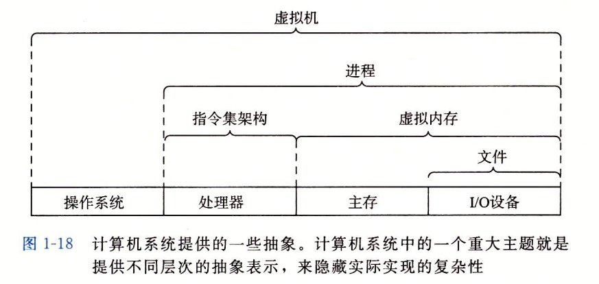

# 操作系统

**参考文献：**

- 《现代操作系统》第四版
- [Zander Zhao个人博客](https://www.cnblogs.com/ZanderZhao/)
- [操作系统学习笔记](https://matrixxt.gitbooks.io/operating-system/content/)

## 1 操作系统的基本概念

[153.操作系统引论](https://www.cnblogs.com/ZanderZhao/p/11042636.html)

操作系统（operating System，OS）是由程序模块组成的系统软件，它能够以尽量有效、合理的方式管理计算机底层硬件资源、规划计算机工作流程、控制程序的执行、提供各种服务功能，为用户提供计算机抽象接口，使得用户能够方便、灵活的使用计算机，计算机系统得以高效运行。

### 1.1 操作系统的功能和目标

 - 资源的管理者
   - 处理机管理
   - 存储器管理
   - 文件管理
   - 设备管理
 - 向用户提供服务
   - 命令接口
   - 程序接口（由一组系统调用组成）
   - GUI
 - 对硬件机器的扩展


### 1.2 操作系统的四个特征
 - 并发：多个事件在宏观上同时发生，但在微观上交替发生。
 - 共享：资源可被多个并发执行的进程共同使用。
 - 虚拟
     - 虚拟存储器
     - 虚拟处理器
 - 异步：进程以不可预知的顺序和速度运行。


### 1.3 操作系统中的抽象

 - 文件是对I/O设备的抽象
 - 虚拟内存是对程序存储器的抽象
 - 进程是对一个正在运行的程序的抽象，也是对处理器、主存和I/O设备的抽象
 - 虚拟机是对整个计算机的抽象

 

### 1.4 操作系统的发展与分类

 - **手工操作阶段**：真空管和穿孔卡片。用户独占全机，人机速度矛盾导致资源利用率极低。

 - 批处理阶段
   - **单道批处理系统(Simple Batch Processing System)**：引入脱机输入/输出技术。为实现对作业的连续处理，需要先把一**批作业以脱机方式输入到磁带上**，并在系统中配上监督程序(Monitor)，在它的控制下，使这批作业能**一个接一个地连续处理**。 
     - 缺点：CPU利用率低。因为在内存中仅有一道程序，每逢该程序在运行中发出I/O请求后，CPU便处于等待状态，必须在其I/O完成后才继续运行。
   - **多道批处理系统(Multiprogrammed Batch Processing System)**（操作系统出现）：多道程序并发执行，共享计算机资源，没有人机交互功能。
     - 优点：
       - **资源利用率高。**引入多道批处理能使多道程序交替运行，以保持CPU处于忙碌状态；在内存中装入多道程序可提高内存的利用率；此外还可以提高I/O设备的利用率。
       - **系统吞吐量大。**能提高系统吞吐量的主要原因可归结为：① CPU和其它资源保持“忙碌”状态；② 仅当作业完成时或运行不下去时才进行切换，系统开销小。
     - 缺点：
       - **平均周转时间长**。由于作业要排队依次进行处理，因而作业的周转时间较长，通常需几个小时，甚至几天。
       - **无交互能力**。用户一旦把作业提交给系统后，直至作业完成，用户都不能与自己的作业进行交互，修改和调试程序极不方便。
 - **分时操作系统(Time Sharing System)**：系统能够及时接收多个用户的输入并在短时间内做出响应。计算机以时间片为单位轮流为各个用户/作业服务，实现人机交互，但是不能优先处理紧急任务
 - **实时操作系统(Real Time System)**：实时系统用于实时控制或实时信息处理，要求的实时性比其它操作系统都要高，特别是实时控制系统。而且要求系统高度可靠，因为任何差错都可能带来巨大的经济损失，甚至是无法预料的灾难性后果。主要特点是及时性和可靠性。
   - 软实时
   - 硬实时

### 1.5 操作系统的运行机制和体系结构

#### 1.5.1 操作系统内核

**操作系统内核是系统管理全部进程所用代码和数据结构的集合。**

**上下文切换（进程切换）**是由操作系统内核管理的，内核是操作系统代码常驻内存的部分。

当应用程序需要操作系统的某些操作时，比如读写文件，它就执行一条特殊的**系统调用（system call）**指令，将控制权传递给内核。然后内核执行被请求的操作并返回应用程序。


#### 1.5.2 特权指令与内核态

特权指令只能在CPU的核心态下运行

|  指令  |  CPU状态  |  程序  |
|  ----  |  ----  |  ----  |
|  特权指令  |  核心态才能运行  |  内核程序  |
|  非特权指令  | 用户态、核心态都能运行  |  应用程序  |

从目态（用户态）转换为管态（核心态）的唯一途径是中断。

#### 1.5.3 大内核与微内核

 - **大内核**：将操作系统的主要功能模块都作为系统内核，运行在核心态。包括时钟管理、中断处理、原语、进程管理、处理器管理、设备管理等功能
   - 优点：高性能
   - 缺点：内核代码庞大，结构混乱，难以维护
 - **微内核**：只把最基本的功能保留在内核。包括时钟管理、中断处理、原语
   - 优点：内核功能少，结构清晰，方便维护
   - 缺点：需要频繁地在核心态和用户态之间切换，性能低

### 1.6 中断与异常

 - 当中断发生时，CPU立即进入核心态（中断是使计算机从用户态->核心态的**唯一途径**），操作系统获得计算机的控制权。
 - 当中断发生后，当前运行的进程暂停运行，并由操作系统内核对中断进行处理。
 - 对于不同的中断信号，会进行不同的处理。


#### 1.6.1 中断的分类

 - 内中断：与当前执行的指令有关， 中断信号来源于CPU内部
   - 自愿中断（指令中断）：**trap指令**
   - 强迫中断
     - 故障：**Page Fault 缺页故障**
     - 终止：除0异常
 - 外中断：与当前执行的指令无关， 中断信号来源于CPU外部
     - I/O中断请求
  - 人工干预

#### 1.6.2 中断处理过程

 - **执行完每个指令之后**，CPU都要检查当前是否有外部中断信号。
 - 如果检测到外部中断信号，则需要**保护被中断进程的CPU环境**（将程序状态字 PSW、程序计数器 PC、各种通用寄存器压入堆栈）。
 - 执行**开中断**指令。
 - 根据中断信号类型查询**中断向量表**，中断硬件从**中断向量**装入新的程序计数器，并执行相应的**中断处理程序**。
    - 汇编程序保存寄存器值，设置堆栈指针。
    - 执行C中断服务程序。
    - 调度程序决定下一个将运行的进程。
   - C过程返回至汇编程序。
   - 汇编程序开始运行新的当前进程。
 - 执行**关中断**指令。
 - **恢复原进程的CPU环境**并退岀中断，返回原进程继续往下执行。
 - 执行**开中断**指令。
 - 中断返回。


### 1.7 系统调用

操作系统作为用户和计算机硬件之间的接口，需要向上提供一些简单易用的服务。主要包括**命令接口**和**程序接口**。其中，程序接口由一组系统调用组成。

- **系统调用是操作系统向上层提供的接口。**
- **库过程是对系统调用的进一步封装。**

#### 1.7.1 系统调用的功能

应用程序通过系统调用请求操作系统的服务。系统中的各种共享资源都由操作系统统一掌管，因此在用户程序中，**凡是与资源有关的操作（如存储分配、IO操作、文件管理等）**，都必须通过系统调用的方式向操作系统提出服务请求，由操作系统代为完成。这样可以**保证系统的稳定性和安全性**，防止用户进行非法操作。

 - 进程控制系统调用
 - 进程通信
 - 内存管理
 - 文件管理
 - 设备管理


#### 1.7.2 系统调用的过程

 - 用户调用程序传递系统调用参数（把参数压入堆栈）。
 - 执行陷入 trap 指令（**内中断**）：用户态切换到核心态。
 - 执行相应的**系统调用处理程序**。
 - 返回用户程序。


## 2 进程与线程

### 2.1 进程

**一个进程就是一个正在执行程序的实例，是系统进行资源分配和调度的一个独立单位。**

**程序段、数据段、PCB三部分组成了进程实体（进程映像）**。一般情况下，我们把进程实体就简称为进程。

例如，所谓创建进程，实质上是创建进程实体中的PCB；而撤销进程，实质上是撤销进程实体中的PCB。

**注意：PCB是进程存在的唯一标志。**

#### 2.1.2 进程的组成

 - PCB (Process Control Block)
   - 进程管理：寄存器、PC、堆栈指针、进程状态、进程ID
   - 存储管理：程序段指针、数据段指针、堆栈段指针
   - 文件管理：根目录、工作目录
 - 程序段
 - 数据段

#### 2.1.3 进程的状态

 - **运行态**
 - **就绪态**
 - **阻塞态**
 - 创建态
 - 终止态
 - 挂起态
   - 阻塞挂起
   - 就绪挂起

 

#### 2.1.4 进程控制

 

用原语实现进程控制，原语运行在核心态，必须连贯执行，采用“关中断”和“开中断”指令来实现。

- **进程的创建**
   - 有四种主要事件会导致进程的创建：
      - 系统初始化
      - 正在运行的程序执行了创建进程的系统调用
      - 用户请求创建一个新进程
   - 一个批处理作业的初始化
   - Linux下使用fork系统调用创建新进程。
   - Windows下使用CreateProcess创建进程。
- **进程的终止**
   - 正常退出（自愿）
   - 出错退出（自愿）
   - 严重错误
   - 被其他进程杀死
- **进程的切换**
  - **上下文**：跟踪进程运行所需的所有状态信息。
  - 进程切换时操作系统就会进行**上下文切换**，即保存当前进程的上下文、恢复新进程的上下文，然后将控制权传递到新进程，新进程就会从它上次停止的地方开始。
  - CPU是通过**内中断**来实现多进程切换的，在中断期间（开中断指令之后、关中断指令之前）执行原语。中断发生后操作系统最底层的工作步骤如下：
     - 硬件压入堆栈程序计数器等
     - 硬件从中断向量装入新的程序计数器
     - 汇编语言过程保存寄存器值
     - 汇编语言过程设置新的堆栈
     - C中断服务例程运行
     - 调度程序决定下一个将运行的进程
     - C过程返回至汇编代码
     - 汇编语言过程开始运行新的当前进程

#### 2.1.5 进程间通信

- 参考：[进程间通信的方式——信号、管道、消息队列、共享内存](https://www.cnblogs.com/luo77/p/5816326.html)
- [[原来 8 张图，就可以搞懂「零拷贝」了]](https://www.cnblogs.com/xiaolincoding/p/13719610.html)

**各进程拥有相互独立的内存地址空间**，一个进程不能直接访问另一个进程的地址空间。

那么如何实现进程间的通信呢？

 - **信号量 Semaphore**：信号量是一个计数器，可以用来控制多个进程对共享资源的访问。
 - **信号 (signal)** ： 信号是一种比较复杂的通信方式，用于通知接收进程某个事件已经发生。
    - 信号是Linux系统中用于进程之间通信或操作的一种机制，信号可以在任何时候发送给某一进程，而无须知道该进程的状态。
    - 如果该进程并未处于执行状态，则该信号就由内核保存起来，直到该进程恢复执行并传递给他为止。例如，如果信号将要被发送至的进程处于阻塞态，则该信号的传递被延迟，直到其阻塞被取消时才被传递给进程。

 - **共享内存（共享存储）**
   
    - 分类：
      - 基于数据结构的共享（低级通信）
      - 基于存储区的共享（高级通信）
   - 优点：**效率高**，因为进程可以直接读写内存，而不需要任何数据的拷贝，对于像**管道和消息队列等通信方式，则需要再内核和用户空间进行四次的数据拷贝**，而**共享内存则只拷贝两次：一次从输入文件到共享内存区，另一次从共享内存到输出文件**。
   
 - **管道通信**

   - 分类：
     
     - 无名管道（pipe）
     - 命名管道（FIFO）
     
   - **四次拷贝：1，由用户空间的buf中将数据拷贝到内核中。2，内核将数据拷贝到内存中。3，内存到内核。4，内核到用户空间的buf.**

   - 管道的实质是一个内核缓冲区，进程以**先进先出**的方式从缓冲区存取数据。

   - 数据以**字符流**的形式写入管道，当管道写满时，写进程的 write（）系统调用将被阻塞，等待读进程将数据取走。当读进程将数据全部取走后，管道变空，此时读进程的 read（）系统调用将被阻塞。

   - **如果没写满，就不允许读。如果没读空，就不允许写。**

   - **数据一旦被读出，就从管道中被抛弃**，这就意味着**读进程最多只能有一个**，否则可能会有读错数据的情况。因此，各进程要**互斥**地访问管道。

   - 管道只能采用**半双工**通信，某一时间段内只能实现单向的传输。如果要实现双向同时通信，则需要设置两个管道。

     - 原因：假设使用一个管道进行全双工通信，如果同一时刻两个进程都执行 read()，则可能发生死锁。代码如下：

     ```c
     #include <stdio.h>
     #include <unistd.h>
     #define BUF_SIZE 30
     
     int main(int argc, char *argv[])
     {
         int fds[2];
         char str1[] = "Who are you?";
         char str2[] = "Thank you for your message";
         char buf[BUF_SIZE];
         pid_t pid;
     
         pipe(fds);
         pid = fork();
         if (pid == 0)
         {
             // 子进程写数据
             write(fds[1], str1, sizeof(str1));
             // 如果将 sleep 注释掉，将可能发生死锁。
             // sleep(2);
             // 子进程和父进程同时读数据，如果子进程先读取到，将会死锁
             read(fds[0], buf, BUF_SIZE);
             printf("Child proc output: %s \n", buf);
         }
         else
         {
             // 子进程和父进程同时读数据，如果父进程先读取到，则不会死锁
             read(fds[0], buf, BUF_SIZE);
             printf("Parent proc output: %s \n", buf);
             write(fds[1], str2, sizeof(str2));
             sleep(3);
         }
         return 0;
     }
     ```

     

 - **信息传递**
   - 直接通信方式：消息直接挂到接收进程的**消息缓冲队列**上。
     - 进程间的数据交换以格式化的**消息（ Message）**为单位。进程通过操作系统提供的“发送消息/接收消息”两个**原语**进行数据交换。
     - **消息队列**，就是一个消息的链表，是一系列保存在内核中消息的列表。用户进程可以向消息队列添加消息，也可以向消息队列读取消息。
   - 间接通信方式：消息先发送到**信箱**中，等待接收进程接收。


#### 2.1.6 【补充】虚拟内存与虚拟地址空间

虚拟内存（虚拟存储器）是指具有请求调页功能和页面置换功能，能从逻辑上对内存容量加以扩充的一种存储器系统。

虚拟内存是一个抽象概念，它为每个进程提供了一个假象，即每个进程都在独占地使用主存。

每个进程看到的内存都是一致的，称为**（虚拟）地址空间**。

 

每个进程看到的地址空间由大量准确定义的区构成，每个区都有专门的功能。从最低的地址开始，逐步向上介绍：

 - 程序代码和数据：直接按照可执行目标文件的内容初始化，在进程一开始运行时就被指定了大小。
 - 运行时堆：当调用像malloc和free这样的C标准库函数时，堆可以在运行时动态地扩展和收缩。
 - 共享库：大约在地址空间的中间部分是一块用来存放像C标准库和数学库这样的共享库的代码和数据的区域
 - 用户栈：编译器用它来实现函数调用，在程序执行期间可以动态地扩展和收缩
 - 内核虚拟内存：地址空间顶部的区域是为内核保留的。不允许应用程序读写这个区域的内容或者直接调用内核代码定义的函数。相反，它们必须调用内核来执行这些操作


### 2.2 线程

线程是一个基本的CPU执行单元，也是程序执行流的最小单位。

引入线程后，**进程只作为除CPU之外的系统资源分配的基本单位**（如打印机、内存地址空间等都是分配给进程的）。**线程则作为调度的基本单位**。

#### 2.2.1 线程的作用：

 - 线程成为CPU资源调度的基本单位，**提高了并发度**。
 - 同一进程内的线程切换，不需要切换进程环境，**减少系统开销**。
 - 使用多线程可以**减少程序的响应时间**。单线程如果遇到等待或阻塞，将会导致程序不响应鼠标键盘等操作，使用多线程可以解决此问题，增强程序的交互性。
 - 多线程可以简化程序的结构，使程序便于维护，一个非常复杂的进程可以分为多个线程执行。

#### 2.2.2 线程的属性

 - **线程是CPU调度的基本单位**
 - 同一进程的每个线程都运行在该进程的上下文中，**共享同样的代码和全局数据（即共享地址空间）**，但是，各个线程拥有自己的栈空间。
 - 每个线程都有一个线程ID、线程控制块（TCB，存放PC、寄存器、堆栈、状态等线程信息）。
 - 线程也有就绪、阻塞、运行三种基本状态。 
 - 线程几乎不拥有系统资源。
 - 同一进程的不同线程间共享进程的资源。
 - 由于共享内存，同一进程中的线程间通信甚至无需系统干预。
 - 同一进程中的线程切换，不会引起进程切换。
 - 不同进程中的线程切换，会引起进程切换。
 - 切换同进程内的线程，系统开销很小。
 - 切换进程，系统开销较大。

#### 2.2.3 线程的实现方式

##### 用户级线程

用户级线程**由应用程序通过线程库实现**，所有的线程管理工作都由应用程序负责（包括线程切换）。

用户级线程中，线程切换可以在用户态下即可完成，无需操作系统干预。在用户看来，是有多个线程。但是在操作系统内核看来，并意识不到线程的存在。（用户级线程对用户不透明，对操作系统透明）

可以这样理解，“用户级线程”就是“从用户视角看能看到的线程”

 - 每个进程需要有其专门的**线程表**，用来追踪该进程中的线程（存放PC、寄存器、堆栈、状态等线程信息）
 - 线程调度在用户态下即可完成，**无需操作系统干预**（不需要陷入内核，不需要上下文切换），因此进程切换很快
 - 可以在不支持线程的操作系统中实现
 - 允许每个进程有自己定制的调度算法
 - 难以实现阻塞系统调用、缺页中断等问题
 - **同一进程的多个线程无法同时运行**

##### 内核级线程

内核级线程**由操作系统内核实现**，所有的线程管理工作都由内核负责，因此内核级线程的切换必然需要在**核心态**下才能完成。

可以这样理解，“内核级线程”就是“从操作系统内核视角看能看到的线程”。

 - 进程中没有线程表，但是内核中有用来记录所有线程的线程表（存放PC、寄存器、堆栈、状态等线程信息）
 - 当有多个处理机时，**一个进程的多个线程可以同时执行**
 - 由于内核中创建或撤销线程的代价较大，内核一般会维护一个线程池

##### 混合实现

综合了用户级线程和内核级线程，每个内核级线程有一个可以轮流使用的用户级线程集合。

只有内核级线程才是CPU分配的基本单位。

- **多对一模型**
  - 多个用户级线程映射到一个内核级线程。每个用户进程只对应一个内核级线程。
  - 优点：用户级线程的切换在用户空间即可完成，不需要切换到核心态，线程管理的系统开销小，效率高
  - 缺点：当一个用户级线程被阻塞后，整个进程都会被阻塞，并发度不高。多个线程不可在多核处理机上并行运行

- **一对一模型**
  - 一个用户级线程映射到一个内核级线程。每个用户进程有与用户级线程同数量的内核级线程。
  - 优点：当一个线程被阻塞后，别的线程还可以继续执行，并发能力强。多线程可在多核处理机上并行执行
  - 缺点：一个用户进程会占用多个内核级线程，线程切换由操作系统内核完成，需要切换到核心态，因此线程管理的成本高，开销大。

- ##### 多对多模型

  - n用户及线程映射到m个内核级线程（n>m）.每个用户进程对应m个内核级线程。
  - 克服了多对一模型并发度不高的缺点，又克服了一对一模型中一个用户进程占用太多内核级线程，开销太大的缺点。


### 2.3 CPU调度

**调度算法：从就绪队列中按照一定的算法挑选一个进程并将CPU分配给它运行，以实现进程的并发执行。**

#### 2.3.1 调度的三个层次

- **高级调度**

由于内存空间有限，有时无法将用户提交的作业全部放入内存，因此就需要确定某种规则来决定将作业调入内存的顺序。

高级调度（作业调度）：按一定的原则**从外存上处于后备队列的作业中**挑选一个（或多个）作业，给他们分配内存等必要资源，并**建立相应的进程（建立PCB）**，以使它（们）获得竞争处理机的权利。

高级调度是**辅存（外存）与内存**之间的调度。**每个作业只调入一次，调出一次。**作业调入时会建立相应的PCB，作业调出时才撤销PCB。高级调度主要是指调入的问题，因为只有调入的时机需要操作系统来确定，但调出的时机必然是作业运行结束才调出。

- ##### 中级调度


引入了虚拟存储技术之后，可将暂时不能运行的进程调至外存等待。等它重新具备了运行条件且内存又稍有空闲时，再重新调入内存。这么做的目的是为了提高内存利用率和系统吞吐量。

暂时调到外存等待的进程状态为**挂起状态**。值得注意的是，**PCB并不会一起调到外存，而是会常驻内存。**PCB中会记录进程数据在外存中的存放位置，进程状态等信息，操作系统通过内存中的PCB来保持对各个进程的监控、管理。被挂起的进程PCB会被放到的挂起队列中。

中级调度（内存调度），就是要决定将哪个处于挂起状态的进程重新调入内存。

**一个进程可能会被多次调出、调入内存**，因此中级调度发生的频率要比高级调度更高。

- 
  ##### 低级调度


低级调度（进程调度），其主要任务是按照某种方法和策略（调度算法）**从就绪队列中**选取一个进程，将处理机分配给它。

进程调度是操作系统中最基本的一种调度，在一般的操作系统中都必须配置进程调度。

进程调度的频率很高，一般几十毫秒一次。

 

#### 2.3.2 进程调度的时机

 - 进程主动放弃CPU
   - 进程正常终止
   - 发生异常终止
   - 主动请求阻塞（等待IO）
 - 进程被动放弃CPU
   - 分给该进程的时间片用完
   - 响应IO中断
   - 被更高优先级的进程抢占

不能进行进程调度的情况：
 - 1.在处理中断的过程中。中断处理过程复杂，与硬件密切相关，很难做到在中断处理过程中进行进程切换
 - 2.进程在**操作系统内核程序临界区**中（内核程序临界区一般是用来访问某种内核数据结构的，比如进程的就绪队列（由各就绪进程的PCB组成））
 - 3.在原子操作过程中（原语），原子操作不可中断，要一气呵成（如之前讲过的修改PCB中进程状态标志，并把PCB放到相应队列）

#### 2.3.3 调度算法的评价指标

 - CPU利用率：指CPU“忙碌”的时间占总时间的比例。
 - 系统吞吐量：单位时间内完成作业的数量
 - 周转时间：是指从作业被提交给系统开始，到作业完成为止的这段时间间隔。
 - 平均周转时间：各作业周转时间之和/作业数
 - 带权周转时间：作业周转时间/作业实际运行时间
 - 平均带权周转时间：各作业带权周转时间之和/作业数
 - 等待时间：周转时间-运行时间-IO操作的时间。等待IO的时间不计入等待时间
 - 响应时间：从用户提交请求到首次产生响应所用的时间


#### 2.3.4 调度算法

### 进程调度的方式————抢占式调度与非抢占式调度

- 非抢占式调度：只允许进程主动放弃处理机。
  - 实现简单，系统开销小但是无法处理紧急的任务，适合于早期的批处理系统。
- 抢占式调度：当一个进程正在处理机上执行时，如果有一个更重要或更紧迫的进程需要使用处理机，则立即暂停正在执行的进程，将处理机分配给更重要紧迫的那个进程。
  - 可以优先处理更紧急的进程，也可实现让各进程按时间片轮流执行的功能（通过时钟中断）。
  - 适合于分时操作系统、实时操作系统。

### 先来先服务（FCFS）

按照作业/进程到达的先后顺序进行服务。

 - 非抢占式
 - 公平
 - 实现简单
 - 对长作业有利，对短作业不利
 - 不会导致饥饿


### 短作业优先（SJF）

追求最少的平均等待时间，最少的平均周转时间、最少的平均带权周转时间。

每次调度时选择当前已到达且运行时间最短的作业进程。

 - 非抢占式
 - 不公平，对短作业有利，对长作业不利
 - 可能产生饥饿


### 最短剩余时间优先（SRTN）

综合考虑作业/进程的等待时间和要求服务的时间。

每当有进程加入就绪队列改变时就需要调度，**如果新到达的进程剩余时间比当前运行的进程剩余时间更短，则由新进程抢占处理机**，当前运行进程重新回到就绪队列。另外，当一个进程完成时也需要调度。

 - 抢占式
 - 平均等待时间、平均周转时间最少
 - 需要提前知道进程的剩余运行时间

### 高响应比优先（HRRN，Highest Response Retio Next）

只有当前运行的进程主动放弃CPU时，才需要进行调度。

**在每次调度时先计算各个作业/进程的响应比，选择响应比最高的作业进程为其服务**。

**响应比=(等待时间+要求服务时间)/要求服务时间 > 1**

 - 非抢占式
 - 综合考虑了FCFS和SJF算法
 - 不会导致饥饿

### 时间片轮转调度算法（RR）

公平地、轮流地为各个进程服务，让每个进程在一定时间间隔内都可以得到响应。

按照各进程到达就绪队列的顺序，轮流让各个进程执行个时间片（如100ms）。若进程未在一个时间片内执行完，则剥夺处理机，将进程重新放到就绪队列队尾重新排队。

用于进程调度（只有作业放入内存建立了相应的进程后，才能被分配处理机时间片）

若进程未能在时间片内运行完，将被强行剥夺处理机使用权，因此时间片轮转调度算法属于抢占式的算法。由时钟装置发出时钟中断来通知CPU时间片已到。

 - 抢占式
 - 公平，响应快，适合于分时操作系统
 - 进程切换带来额外开销
 - 不区分任务的紧急程度
 - 不会导致饥饿


### 优先级调度算法

每个作业/进程有各自的优先级，调度时选择优先级最高的作业/进程。

既可用于作业调度，也可用于进程调度。甚至，还会用于在之后会学习的1/O调度中。

 - 抢占式、非抢占式都有。做题时的区别在于：非抢占式只需在进程主动放弃处理机时进行调度即可，而抢占式还需在就绪队列变化时，检查是否会发生抢占。
 - 区分优先级，适合实时操作系统
 - 会导致饥饿

### 保证调度（Guaranteed Scheduling）

保证在某个时间段内一定会对调用某个进程。举例，n个进程，CPU可以承诺至少会有1/n的时间给某个进程

调度方法：

 - 计算真正获得的CPU时间与应该获得CPU时间的⽐例
 - 选择最低的进程运行
 - ⼀般不会导致饥饿


### 彩票调度（Lottery Scheduling）

将一些彩票分配给不同进程，每个进程获得的数量由优先级决定，然后随机抽出一张，拥有这张彩票的进程获得一定的资源。

其中，高优先级的进程可以被分配更多的彩票以提高中奖率。


### 公平分享调度（Fair-Share Scheduling）

考虑每个用户，让使用CPU时间少于应得份额的用户优先运行进程。

### 多极反馈队列调度算法

用于进程调度。

设置多级就绪队列，各级队列优先级从高到低，时间片从小到大。

新进程到达时先进入第1级队列，按FCFS原则排队等待被分配时间片，若用完时间片进程还未结束，则进程进入下一级队列队尾。如果此时已经是在最下级的队列，则重新放回该队列队尾。

只有第k级队列为空时，才会为k+1级队头的进程分配时间片。

 - 抢占式算法。在k级队列的进程运行过程中，若更上级的队列（1~k1级）中进入了一个新进程，则由于新进程处于优先级更高的队列中，因此新进程会抢占处理机，原来运行的进程放回k级队列队尾；
 - 对各类型进程相对公平（FCFS的优点）；
 - 每个新到达的进程都可以很快就得到响应（RR的优点）；
 - 短进程只用较少的时间就可完成（SPF的优点）；
 - 不必实现估计进程的运行时间（避免用户作假）
 - 可灵活地调整对各类进程的偏好程度，比如CPU密集型进程、I/O密集型进程（拓展：可以将因I/O而阻塞的进程重新放回原队列，这样I/O型进程就可以保持较高优先级）
 - 会导致饥饿。

#### 2.4.5 线程调度

##### 用户级线程的调度

- 用户级线程**由应用程序通过线程库实现**，所有的线程管理工作都由应用程序负责（包括线程切换）。

- 线程可以按其意愿任意运行多长时间，因为多道线程不存在时钟中断。
- 线程切换只需要少量的机器指令，速度快。
- 可以使用转为程序定制的线程调度程序。

##### 内核级线程的调度

- 内核级线程**由操作系统内核实现**，所有的线程管理工作都由内核负责。
- 为被选择的线程赋予一个时间片，如果超过了时间片线程还未完成，则强制挂起该线程。
- 线程切换（在核心态完成）需要完整的上下文切换，修改内存映像，使高速缓存失效，所以速度慢。
- 线程调度时，内核优先选择与刚执行完的线程同进程的线程执行，因为切换进程需要修改内存映像，使高速缓存失效，代价较大。


### 2.4 进程同步与互斥

同步亦称直接制约关系，它是指为完成某种任务而建立的两个或多个进程，这些进程因为需要在某些位置上协调它们的工作次序而产生的制约关系。进程间的直接制约关系就是源于它们之间的相互合作。

#### 2.4.1 进程互斥

一个时间段内只允许一个进程使用的资源称为**临界资源**。许多物理设备（比如摄像头、打印机）都属于临界资源。此外还有许多变量、数据、内存缓冲区等都属于临界资源。

**对临界资源的访问，必须互斥地进行**。互斥，亦称间接制约关系。进程互斥指当一个进程访问某临界资源时，另一个想要访问该临界资源的进程必须等待。当前访问临界资源的进程访问结束，释放该资源之后，另一个进程才能去访问临界资源。


```
do {
  entry sectlon i	//进入区
  critical section；//临界区
  exit section		//退出区
  remainder section；//剩余区
} while（true)
```

 - 临界区是进程中访问临界资源的代码段。
 - 进入区和退出区是负责实现互斥的代码段。
 - 临界区也可称为“临界段”。


为了实现对临界资源的互斥访问，同时保证系统整体性能，需要遵循以下原则:

 - 空闲让进。临界区空闲时，可以允许一个请求进入临界区的进程立即进入临界区。
 - 忙则等待。当已有进程进入临界区时，其他试图进入临界区的进程必须等待。
 - 有限等待。对请求访问的进程，应保证能在有限时间内进入临界区（保证不会饥饿）。
 - 让权等待。当进程不能进入临界区时，应立即释放处理机，防止进程忙等待。


#### 2.4.2 进程互斥的软件实现方法

##### 单标志法/严格轮换法

```
int turn = 0;

P0进程:
while (turn != 0);
critical section;
turn = 1;
remainder section;

P0进程:
while (turn != 1)
critical section
turn = 0:
remainder section
```

算法思想：两个进程在访问完临界区后会把使用临界区的权限转交给另一个进程。也就是说每个进程进入临界区的权限只能被另一个进程赋予。

缺点：违背了“空闲让进”原则


##### Peterson算法

```
bool flag [2];	//表示进入临界区意愿的数组，初始值都是 false
int turn = 0;	//turn表示优先让哪个进程进入临界区

P0进程:
flag[0] = true;	//表示自己想进入临界区
turn = 1;		//可以优先让对方进入临界区
while (flag[1] && turn==1);
critical section：
flag[0] = false；	//访问完临界区，表示自己已经不想访问临界区了
remainder section；

P1进程：
flag[1] = true;	//表示自己想进入临界区
turn = 0;		//可以优先让对方进入临界区
while (flag[0] && turn==0);//对方想进，且最后一次是自己“让梨”，那自己就循环等待
critical section：
flag[1] = false；
remainder section;
```

Peterson算法用软件方法解决了进程互斥问题，遵循了空闲让进、忙则等待、有限等待三个原则，但是依然未遵循让权等待的原则。

Peterson算法相较于之前三种软件解决方案来说，是最好的，但依然不够好。


#### 2.4.3 进程互斥的硬件实现方法

##### 中断屏蔽方法

利用“开/关中断指令”实现（与原语的实现思想相同，即在某进程开始访问临界区到结束访问为止都不允许被中断，也就不能发生进程切换，因此也不可能发生两个同时访问临界区的情况）

 - 优点：简单、高效
 - 缺点：不适用于多处理机；只适用于操作系统内核进程，不适用于用户进程（因为开/关中断指令只能运行在内核态，这组指令如果能让用户随意使用会很危险）。

##### TSL (Test and Set Lock) 指令

TSL指令是用硬件实现的，执行的过程不允许被中断，只能一气呵成。以下是用C语言描述的逻辑：

```
//布尔型共享变量lock表示当前临界区是否被加锁
//true表示已加锁，false表示未加锁
bool TestAndSet（bool *lock){
  bool old；
  old=*Lock；//old用来存放Lock原来的值
  *Lock=true；//无论之前是否已加锁，都将Lock设为true
  return old；//返回Lock原来的值
}

//以下是使用TSL指令实现互斥的算法逻辑
while (TestAndset(&lock)）;	//“上锁”并“检查”
//临界区代码段...
lock = false;	//“解锁”
//剩余区代码段...
```


相比软件实现方法，TSL指令把“上锁”和“检查”操作用硬件的方式变成了一气呵成的原子操作。

优点：实现简单，无需像软件实现方法那样严格检査是否会有逻辑漏泂；适用于多处理机环境。

缺点：**不满足“让权等待”原则**，暂时无法进入临界区的进程会占用CPU并循环执行TSL指令，从而导致“忙等”。


##### Swap (XCHG) 指令

Swap指令是用硬件实现的，执行的过程不允许被中断，只能一气呵成。以下是用C语言描述的逻辑：

```
//Swap指令作业是交换两个变量的值
bool Swap（bool *a, bool *b){
  bool temp;
  temp = *a;
  *a = *b;
  *b = temp;
}

//以下是使用Swap指令实现互斥的算法逻辑
bool old = true;
while(old == true){
  swap(&lock, &old);
}
//临界区代码段...
lock = false;	//“解锁”
//剩余区代码段...
```

优缺点同TSL指令。


#### 2.4.4 信号量

[【转】进程同步之信号量机制（pv操作）及三个经典同步问题](https://www.cnblogs.com/zhangbaochong/p/5800650.html)

1965年，荷兰学者 Dijkstra提出了一种卓有成效的实现进程互斥、同步的方法一一信号量机制。

- 信号量（semaphore）的数据结构为一个值和一个指针，指针指向等待该信号量的下一个进程。信号量的值与相应资源的使用情况有关。
- 当它的值大于0时，表示当前可用资源的数量；
- 当它的值小于0时，其绝对值表示等待使用该资源的进程个数。

**原语**：一种特殊的程序段，其执行只能一气呵成，不可被中断。

- 原语是由关中断/开中断指令实现的。

软件解决方案的主要问题是由“进入区的各种操作无法一气呵成”造成的，因此如果能把进入区、退出区的操作都用“原语”实现，使这些操作能“一气呵成”就能避免问题。

用户进程可以通过使用操作系统提供的**一对原语**来对信号量进行操作，从而很方便的实现了进程互斥、进程同步。

一对原语：wait（W）原语和signal（S）原语，可以把原语理解为我们自己写的函数，函数名分别为wait和signal，括号里的信号量S其实就是函数调用时传入的一个参数。

wait、signal原语常简称为**P、V操作**（来自荷兰语 proberen 和 verhogen）。

```
/*记录型信号量的定义*/
typedef struct t{
  int value;		//剩余资源数
  Struct process* L;	//等待队列
} semaphore

/*某进程需要使用资源时，通过wait原语申请*/
void wait (semaphore S){
  s.value--：
  if (S.value < 0){
    block (S.L);	//调用block进行自我阻塞，进程从运行态->阻塞态，避免“忙等”，可见，该机制**遵循了“让权等待”原则**，不会出现“忙等”现象。
  }
}

/*进程使用完资源后，通过signal原语释放*/
void signal (semaphore s){
  s.value++：
  if (S.value <= 0){
    wakeup(S.L);
  }
}
```


对信号量S的一次Ⅴ操作意味着进程释放一个单位的该类资源，因此需要执行 S value++，表示资源数加1。

若加1后仍是 S.value<=0，表示依然有进程在等待该类资源，因此应调用wakeup原语唤醒等待队列中的第一个进程（被唤醒进程从阻塞态→就绪态）。

##### 用信号量实现进程互斥

 - 划分临界区
 - 设置互斥信号量mutex，初值为1
 - 在临界区之前执行P(mutex)
 - 在临界区之后执行V(mutex)


```
/*信号量机制实现互斥*/
semaphore mutex=1; //初始化信号量

P1(){
  ...
  P(mutex);	//使用临界资源前需要加锁
  //临界区代码段...
  V(mutex)	//使用临界资源后需要解锁
  ...
}

P2（）{
  ...
  P(mutex);	//使用临界资源前需要加锁
  //临界区代码段...
  V(mutex)	//使用临界资源后需要解锁
  ...
}
```


 - 每个临界资源对应一个互斥信号量
 - P、V必须成对出现


##### 用信号量实现进程同步

 - 分析什么地方需要实现“同步关系”
 - 设置同步信号量S，初始为0
 - 在“前操作”之后执行V(S)
 - 在“后操作”之前执行P(S)

##### 生产者-消费者问题

生产者-消费者问题(producer-consumer problem)是指若干进程通过有限的共享缓冲区交换数据时的缓冲区资源使用问题。

假设“生产者”进程不断向共享缓冲区写人数据(即生产数据)，而“消费者”进程不断从共享缓冲区读出数据(即消费数据)；

共享缓冲区共有n个；任何时刻只能有一个进程可对共享缓冲区进行操作。所有生产者和消费者之间要协调，以完成对共享缓冲区的操作。

```c
semaphore mutex = 1; //用于缓冲区互斥访问
semaphore empty = N; //缓冲区空槽数目
semaphore full = 0; //缓冲区满槽数目

void producer(void){
    while(1)
        wait(empty) ;  
        wait(mutex) ;  
        //add nextp to buffer  
        signal(mutex) ;  
        signal(full) ;  
    }
}

void consumer(void){
    while(1)
        P(full);
    	P(mutex); 
    	//remove an item from buffer to nextp  
        V(mutex);
    	V(empty); 
	}
}
```

这里每个进程中各个P操作的次序是重要的。各进程必须先检查自己对应的资源数在确信有可用资源后再申请对整个缓冲区的互斥操作；否则，先申请对整个缓冲区的互斥操后申请自己对应的缓冲块资源，就可能死锁。

##### 读者一写者问题(readers-writers problem)

多个进程对一个共享资源进行读写操作的问题。

假设“读者”进程可对共享资源进行读操作，“写者”进程可对共享资源进行写操作；任一时刻“写者”最多只允许一个，而“读者”则允许多个。即对共享资源的读写操作限制关系包括：“读—写，互斥、“写一写”互斥和“读—读”允许。

我们可认为写者之间、写者与第一个读者之间要对共享资源进行互斥访问，而后续读者不需要互斥访问。

```c
/* 读者优先算法 */
semaphore mutex = 1; //用于控制read_cnt的互斥访问
semaphore write_mutex = 1; //控制写者的访问
int read_cnt = 0; //读者的数目

void reader(void){
    P(mutex);
    read_cnt++;
    if(read_cnt == 1){
        P(write_mutex);
    }
    V(mutex);
    read_data();
    P(mutex);
    read_cnt--;
    if(read_cnt==0){
        V(write_mutex);
    }
    V(mutex);
}

void write(void){
    P(write_mutex);
    write_data();
    V(write_mutex);
}
```

##### 写者优先的读写者问题

如果有写者申请写文件，那么在申请之前已经开始读取文件的可以继续读取，但是如果再有读者申请读取文件，则不能够读取，**只有在所有的写者写完之后才可以读取**。

**我们可以通过增加一个特权级队列来实现这个功能，一旦有写者申请写，那么后面的读者全部在特权及队列中排队**。

```c
/* 写者优先的读写者问题*/
semaphore write_mutex = 1; //用于控制写者的互斥写
semaphore rc_mutex = 1; //用于控制对read_cnt的互斥访问
semaphore wc_mutex = 1; //用于控制对write_cnt的互斥访问
semaphore queue = 1; //一旦有写者申请写，那么后面的读者全部在特权及队列中排队
int read_cnt = 0; //读者的数目
int write_cnt = 0; //写者的数目

void reader(void){
    P(queue); //每个读进程在读取之前都申请一下queue，并且在申请成功读者数加一后就释放queue
    read_cnt++;
    if(read_cnt == 1){
        P(write_mutex);
    }
    V(queue);
    
    //read_data();
    
    P(read_mutex);
    read_cnt--;
    if(read_cnt == 0){
        V(write_mutex);
    }
    V(read_mutex);
}

void write(void){
    P(wc_mutex);
    ++write_cnt;
    if(write_cnt == 1){
        P(queue); //第一个写进程申请的时候占据queue，后面的写进程无需申请queue，直到所有的写进程结束后才释放queue
    }
    V(wc_mutex);
    
    P(write_mutex);
    //write_data();
    V(write_mutex);
    
    P(wc_mutex);
    --write_mutex;
    if(write_mutex == 0){
        V(queue);
    }
    V(wc_mutex);
}
```

##### 公平竞争的读写者问题

当读者和写者同时到来时，双方中的一方都有可能工作。

```c
semaphore rc_mutex = 1; //用于控制对read_cnt的互斥访问
semaphore write_mutex = 1; //用于控制写者的互斥写
semaphore read_write_mutex = 1; //读写者公平竞争的关键！！！
int read_cnt = 0; //读者的数目

void reader(void){
    P(read_write_mutex); //读者与写者竞争获取read_write_mutex
    P(rc_mutex);
    ++read_cnt;
    if(read_cnt == 1){
        P(write_mutex); //可能存在多个读者竞争成功，因此需要read_cnt计数
    }
    V(rc_mutex);
    
    //read_data()
    
    P(rc_mutex);
    --read_cnt;
    if(read_cnt == 0){
        V(write_cnt);
    }
    V(rc_mutex);
}

void write(void){
    P(read_write_mutex); //读者与写者竞争获取read_write_mutex
    P(write_mutex); //竞争成功的写者需要等待所有读者执行完毕
    write_data();
    V(write_mutex);
    V(read_write_mutex);
}
```

#### 2.4.5 管程

管程是一个由过程、变量及数据结构等组成的一个集合，是一种特殊的软件模块，由下列组成：

 - 1.局部于管程的共享**数据结构**说明
 - 2.对该数据结构进行操作的一组**过程**
 - 3.对局部于管程的**共享数据**设置初始值的语句
 - 4.管程有一个**名字**

管程的基本特征：

 - 1.局部于管程的数据只能被局部于管程的过程所访问
 - 2.一个进程只有通过调用管程内的过程才能进入管程访问共享数据
 - 3.每次仅允许一个进程在管程内执行某个内部过程。
 - 4.各进程必须互斥访问管程的特性是由编译器实现的
 - 5.可在管程中设置条件变量及等待唤醒操作以解决同步问题


## 3 死锁

### 3.1 死锁的概念

如果一个进程集合中的每个进程都在等待只能由该进程集合中的其他进程才能引发的事件，那么，该进程集合就是死锁的。

#### 3.1.1 死锁的根本原因

 - 资源有限
 - 进程推进顺序非法


#### 3.1.2 死锁的必要条件

 - 互斥条件：资源无法被多个进程共享，每个资源要么已经分配给了一个进程，要么就是可用的。
 - 不可抢占条件：进程所获得的资源在未使用完之前，不能由其他进程强行夺走，只能主动释放。
 - 占有和等待条件：已经得到了资源的进程可以再请求新的资源。
 - 循环等待条件：存在一种进程资源的循环等待链，链中的每一个进程已获得的资源同时被下一个进程所请求。

### 3.2 死锁预防

死锁预防是通过破坏死锁的四个必要条件之一实现的

#### 3.2.1 破坏互斥条件

Spooling 假脱机技术。


#### 3.2.2 破坏占有并等待条件

方案一：静态分配方法：即**进程在运行前一次申请完它所需要的全部资源**，在它的资源未满足前，不让它投入运行。一旦投入运行后，这些资源就一直归它所有，该进程就不会再请求别的任何资源。

该策略实现起来简单，但也有明显的缺点：

 - 进程可能不知道自己需要多少资源
 - 有些资源可能只需要用很短的时间，因此如果进程的整个运行期间都一直保持着所有资源，就会造成严重的资源浪费，资源利用率极低。
 - 可能导致某些进程饥饿。

方案二：要求当一个进程请求资源时，先**暂时释放其当前占有的所有资源**，然后尝试一次或许所需的全部资源。


#### 3.2.3 破坏不抢占条件

方案一：当某个进程请求新的资源得不到满足时，它必须立即释放保持的所有资源，待以后需要时再重新申请。也就是说，即使某些资源尚未使用完，也需要主动释放，从而破坏了不可剥夺条件。

- 只要暂时得不到某个资源，之前获得的那些资源就都需要放弃，以后再重新申请。如果一直发生这样的情况，就会导致进程饥饿。

方案二：当某个进程需要的资源被其他进程所占有的时候，可以由操作系统协助，**将想要的资源强行剥夺**。这种方式一般需要考虑各进程的优先级（比如：剥夺调度方式，就是将处理机资源强行剥夺给优先级更高的进程使用）

该策略的缺点：
 - 1.实现起来比较复杂。
 - 2.释放已获得的资源可能造成前一阶段工作的失效。因此这种方法一般只适用于易保存和恢复状态的资源，如CPU。
 - 3.反复地申请和释放资源会增加系统开销，降低系统吞吐量。


#### 3.2.4 破坏环路等待条件

可采用顺序资源分配法。首先**给系统中的资源编号，规定每个进程必须按编号递增的顺序请求资源**，同类资源（即编号相同的资源）一次申请完。

- 一个进程得到某层的一个资源后，只能申请较高层的资源
- 当进程释放某层的一个资源时，必须先释放所占有的较高层的资源
- 当进程获得某层的一个资源时，如果想申请同层的另一个资源，必须先释放此层中已占有的资源

该策略的缺点：

 - 1.不方便增加新的设备，因为可能需要重新分配所有的编号
 - 2.进程实际使用资源的顺序可能和编号递增顺序不一致，会导致资源浪费
 - 3.必须按规定次序申请资源，用户编程麻烦。


### 3.3 死锁避免

系统对进程发出每一个系统能够满足的资源申请进行动态检查，并根据检查结果决定是否分配资源，如果分配后系统可能发生死锁，则不予分配，否则予以分配。这是一种保证系统不进入死锁状态的动态策略。

#### 3.3.1 安全状态和不安全状态

安全序列：指如果系统按照这种序列分配资源，则每个进程都能顺利完成，即每一步分配资源时，都有**进程需求的资源数 <= 剩余的资源数**。

只要能找出一个安全序列，系统就是安全状态。当然，安全序列可能有多个。

**安全状态**：没有死锁发生，并且即使所有进程突然请求对资源的最大需求，也存在某种调度次序能够使得每一个进程运行完毕，则称该状态是安全的，否则称为不安全状态。


#### 3.3.2 银行家算法

银行家算法是荷兰学者 Dijkstra为银行系统设计的，以确保银行在发放现金贷款时，不会发生不能满足所有客户需要的情况。后来该算法被用在操作系统中，用于避免死锁。

核心思想：**进程提出资源申请，如果满足请求之后还在安全状态，则满足该请求，否则，推迟（拒绝）该请求。**

**银行家算法步骤**：

 - ①检査此次申请是否超过了之前声明的最大需求数。
 - ②检査此时系统剩余的可用资源是否还能满足这次请求。
 - ③试探着分配，更改各数据结构。
 - ④用安全性算法检査此次分配是否会导致系统进入不安全状态

**安全性算法步骤**：

 - 检査当前的剩余可用资源是否能满足某个进程的最大需求，如果可以，就把该进程加入安全序列，并把该进程持有的资源全部回收。
 - 不断重复上述过程，看最终是否能让所有进程都加入安全序列。
 - 如果所有进程都能加入安全序列，则表明此时处于安全状态，否则处于不安全状态。

**例题**：[银行家算法](https://zhuanlan.zhihu.com/p/59533950)


### 3.4 死锁检测和死锁恢复

#### 3.4.1 每种类型一个资源的死锁检测


构建**资源分配图**，如果这张图包含了环，那么死锁就存在。在此环中的任何一个进程都是死锁进程。

 - 两种结点
   - 进程结点（圆形）：对应一个进程
   - 资源结点（正方形）：对应一类资源，一类资源可能有多个
 - 两种边
   - 进程结点一一>资源结点：表示进程想申请几个资源（每条边代表一个）
   - 资源节点一一>进程结点：表示已经为进程分配了几个资源（每条边代表一个）

#### 3.4.2 每种类型多个资源的死锁检测


上图中，有三个进程四个资源，每个数据代表的含义如下：

- E 向量：资源总量
- A 向量：资源剩余量
- C 矩阵：每个进程所拥有的资源数量，每一行都代表一个进程拥有资源的数量
- R 矩阵：每个进程请求的资源数量

进程 P1 和 P2 所请求的资源都得不到满足，只有进程 P3 可以，让 P3 执行，之后释放 P3 拥有的资源，此时 A = (2 2 2 0)。P2 可以执行，执行后释放 P2 拥有的资源，A = (4 2 2 1) 。P1 也可以执行。所有进程都可以顺利执行，没有死锁。

算法总结如下：

每个进程最开始时都不被标记，执行过程有可能被标记。当算法结束时，任何没有被标记的进程都是死锁进程。

1. 寻找一个没有标记的进程 Pi，它所请求的资源小于等于 A。
2. 如果找到了这样一个进程，那么将 C 矩阵的第 i 行向量加到 A 中，标记该进程，并转回 1。
3. 如果没有这样一个进程，算法终止。

### 3.5 死锁恢复

 - 资源剥夺法（利用抢占恢复）：挂起（暂时放到外存上）某些死锁进程，并抢占它的资源，将这些资源分配其他的死锁进程。但是应防止被挂起的进程长时间得不到资源而饥饿。
 - 撤销进程法（或称终止进程法）：强制撤销部分、甚至全部死锁进程，并剥夺这些进程的资源。实现简单，代价可能会很大。
 - 进程回退法。让一个或多个死锁进程回退到足以避免死锁的地步。这就要求系统要记录进程的历史信息，设置还原点。

## 4 内存管理

- 参考资料：
  - [153.操作系统引论](https://www.cnblogs.com/ZanderZhao/p/11042636.html)
  - [157.虚拟存储器](https://www.cnblogs.com/ZanderZhao/p/11044810.html)

### 4.1 内存的基础知识

内存用于存放数据和指令，由许多个存储单元组成。

#### 4.1.1 程序的运行过程

程序要运行，首先必须装入内存，用户源程序要变成一个可以在内存运行的程序，通常要经过编译，链接，装入3个步骤。

源代码 --编译--> 目标模块 --链接--> 装入模块 --装入--> 内存

- **编译**。用户源程序经过编译产生**目标模块**，目标模块以“0”作为开始地址，而目标模块的地址称为逻辑地址。
- **链接**。将编译后的多个目标模块以及它们所需要的库函数链接在一起，形成**装入模块**，装入模块具有统一的地址空间，**此阶段，形成了程序的逻辑地址**。
- **装入**。将装入模块装载入内存的实际物理空间，并修改程序中与地址有关的代码，这个过程叫做**地址的重定位**。实现逻辑地址到物理地址的转换。**此阶段形成了程序的物理地址**。

#### 4.1.1 程序链接的三种方式

**链接**：将编译后的多个目标模块以及它们所需要的库函数链接在一起，形成**装入模块**，装入模块具有统一的地址空间，**在链接时期形成了程序的逻辑地址**。

- **静态链接**：在程序运行之前先将各目标模块及它们所需的库函数连接成一个完整的可执行文件（装入模块）之后不再拆开。
- **动态链接**：根据动态链接时机的不同，又分为装入时动态链接和运行时动态链接。
  - **装入时动态链接**：将各目标模块装入内存时，边装入边链接的链接方式。
    - 遇到外部引用的时候，此时引用装入程序，找出相应的外部目标模块，并存入内存，同时修改目标模块中的相对地址。
  - **运行时动态链接**：在程序执行中需要该目标模块时，才对它进行链接。
    - 优点：便于修改和更新，便于实现对目标模块的共享。

#### 4.1.2 程序装入的三种方式

- **绝对装入**：在编译时，如果知道程序将放在内存中的哪个位置，**编译程序将产生绝对地址的目标代码**。
  - 绝对装入只适用于单道程序环境。
- **静态重定位**：又称可重定位装入。**编译、链接后的装入模块的地址都是从0开始的，指令中使用的地址、数据存放的地址都是相对于起始地址而言的逻辑地址**。可根据内存的当前情况，将装入模块装入到内存的适当位置。
  - **装入时对地址进行“重定位”**，将逻辑地址变换为物理地址（地址变换是在装入时一次完成的）。
  - 特点：在一个作业装入内存时，必须分配其要求的全部内存空间，如果没有足够的内存，就不能装入该作业
  - 缺点：作业一旦进入内存后，在运行期间就不能再移动，也不能再申请内存空间。
- **动态重定位**：又称动态运行时装入。编译、链接后的装入模块的地址都是从0开始的，**程序在执行的过程中才进行地址重定位**。因此装入内存后所有的地址依然是逻辑地址。
  - 这种方式需要一个**重定位寄存器**的支持。程序运行的时候，**CPU每取一条访存指令，地址变换硬件逻辑会自动将指令中的相对地址与重定位寄存器的地址相加，所得的值为绝对地址，然后根据绝对地址访问。**
  - 采用动态重定位时允许程序在内存中发生移动。**请求分页式存储就是采用了动态重定位。**

### 4.2 覆盖与交换

本节介绍操作系统是如何对内存空间进行扩充的。

内存空间的扩充主要有三种方式：

 - 覆盖技术
 - 交换技术
 - 虚拟内存

#### 4.2.1 覆盖技术

覆盖技术的思想：将程序分为多个段（多个模块）常用的段常驻内存，不常用的段在需要时调出内存。

内存中分为一个“固定区”和若干个“覆盖区”。需要常驻内存的段放在“固定区”中，调入后就不再调出（除非运行结束），不常用的段放在“覆盖区”，需要用到时调入内存，用不到时调出内存。

必须由程序员声明覆盖结构，操作系统完成自动覆盖。缺点：对用户不透明，増加了用户编程负担。覆盖技术只用于早期的操作系统中，现在已成为历史。


#### 4.2.2 交换技术

交换（对换）技术的设计思想：内存空间紧张时，系统将内存中某些进程暂时换出外存（进程从就绪/阻塞态->**挂起态**），把外存中某些已具备运行条件的进程换入内存（进程在内存与磁盘间动态调度）。

交换技术是**中级调度**的具体实现方式。

- 应该在外存（磁盘）的什么位置保存被换出的进程？
  - 具有对换功能的操作系统中，通常把磁盘空间分为**文件区**和**对换区**两部分。
    - 文件区主要用于存放文件，主要追求存储空间的利用率，因此对文件区空间的管理采用离散分配方式；
    - 对换区空间只占磁盘空间的小部分，被换出的进程数据就存放在对换区。
      - 由于对换的速度直接影响到系统的整体速度，因此对换区空间的管理主要追求换入换出速度，所以通常对换区采用连续分配方式（学过文件管理章节后即可理解）。
      - 总之，对换区的1/O速度比文件区的更快。
- 什么时候应该交换？
  - 交换通常在许多进程运行且内存吃紧时进行，而系统负荷降低就暂停。例如：在发现许多进程运行时经常发生缺页，就说明内存紧张，此时可以换出一些进程，如果缺页率明显下降，就可以暂停换出。
- 应该换出哪些进程？
  - 可优先换出阻塞进程；
  - 可换出优先级低的进程；
  - 为了防止优先级低的进程在被调入内存后很快又被换出，有的系统还会考虑进程在内存的驻留时间。
  - P.S. PCB会常驻内存，不会被换出。


### 4.3 内存管理

 - 操作系统负责**内存空间的分配与回收**。
   - **连续分配管理方式**：为用户进程分配的必须是一个连续的内存空间
     - 单一连续内存分配
     - 固定分区内存分配
       - 分区大小相等
       - 分区大小不等
     - 动态分区内存分配
   - **非连续分配管理**方式：为用户进程分配的可以是一些分散的内存空间
     - 分页存储管理
     - 分段存储管理
     - 段页式存储管理
 - 操作系统需要提供某种技术**从逻辑上对内存空间进行扩充**。
   - 覆盖技术
   - 交换技术
   - 虚拟存储技术
 - 操作系统需要提供**地址转换**功能，负责程序的逻辑地址与物理地址的转换（地址重定位，工作在第三种程序装入方式——动态重定位）。
 - 操作系统需要提供存储保护功能，保护各进程在各自存储空间内运行，互不干扰。

    - 设置上下限寄存器进行越界检查
    - 采用重定位寄存器（基址寄存器）和界地址寄存器进行越界检查

#### 4.3.1 连续分配内存管理

- 内部碎片：分配给某进程的内存区域中，如果有些部分没有用上。

- 外部碎片：是指内存中的某些空闲分区由于太小而难以利用。


##### 单一连续内存分配

适用于早期的单用户、单任务的操作系统中。

在单一连续分配方式中，内存被分为**系统区**和**用户区**。系统区通常位于内存的低地址部分，用于存放操作系统相关数据；用户区用于存放用户进程相关数据。内存中只能有一道用户程序，用户程序独占整个用户区空间。

优点：实现简单：无外部碎片；可以采用覆盖技术扩充内存；不一定需要采取内存保护（eg：早期的PC操作系统 MS-DOS）。

缺点：只能用于单用户、单任务的操作系统中；有内部碎片；存储器利用率极低。

##### 固定分区内存分配

1960s出现了多道程序设计操作系统，出现了能够支持多个程序同时运行的固定分区内存分配方式。

固定分区内存分配将整个用户控件划分为若干个固定大小的分区，每个分区装入一道作业。

固定分区内存分配可分为：

 - 分区大小相等
 - 分区大小不等

优点：实现简单，无外部碎片。

缺点：

 - 当用户程序太大时，可能所有的分区都不能满足需求，此时不得不采用覆盖技术来解决，但这又会降低性能；
 - 会产生内部碎片，内存利用率低。

##### 动态分区内存分配

动态分区分配又称为可变分区分配。这种分配方式不会预先划分内存分区，而是在进程装入内存时，根据进程的大小动态地建立分区，并使分区的大小正好适合进程的需要。因此系统分区的大小和数目是可变的。（eg：假设某计算机内存大小为64MB，系统区8MB，用户区共56MB.）

动态分区分配没有内部碎片，但是有外部碎片。

如果内存中空闲空间的总和本来可以满足某进程的要求，但由于进程需要的是一整块连续的内存空间，因此这些“碎片”不能满足进程的需求。可以通过**紧凑（拼凑， Compaction）技术**来解决外部碎片。

记录内存使用情况的数据结构：
 - 空闲分区表
 - 空闲分区链

动态分区分配算法：

 - 首次适应算法（First Fit）：每次都从低地址开始查找，找到第一个能满足大小的空闲分区。
 - 最佳适应算法（Best Fit）：寻找大小刚好能满足的最小分区进行分配。会产生很多的外部碎片。
 - 最坏适应算法（Worst Fit）：优先选择最大的连续空闲区进行分配。晚到的“大进程”可能难以分配。
 - 邻近适应算法（Next Fit）：空闲分区以地址递增的顺序排列（可排成一个循环链表），每次分配内存时从上次查找结束的位置开始查找空闲分区链（或空闲分区表），找到大小能满足要求的第一个空闲分区。

 


#### 4.3.2 分页存储管理

考虑支持多道程序的两种连续分配方式：

 - 固定分区分配：缺乏灵活性，**会产生大量的内部碎片**，**内存的利用率很低**
 - 动态分区分配：会**产生很多外部碎片**，虽然可以用“紧凑”技术来处理，但是“紧凑”的时间代价很高

基于这一思想，产生了**“非连续分配方式”**，或者称为“离散分配方式”。

##### 内存管理

 - 内存空间的分配与回收：
   - 连续分配管理方式：为用户进程分配的必须是一个连续的内存空间
     - 单一连续内存分配
     - 固定分区内存分配
       - 分区大小相等
       - 分区大小不等
     - 动态分区内存分配
   - 非连续分配管理方式：为用户进程分配的可以是一些分散的内存空间
     - 分页存储管理
     - 分段存储管理
     - 段页式存储管理
 - 内存空间的扩充
 - 地址转换
 - 存储保护

##### 页框

将**内存空间**分为一个个大小相等的分区（比如：每个分区4KB），每个分区就是一个“页框”，或称“页帧”、“内存块”、“物理块”。

每个页框有一个编号，即“页框号”（或者“内存块号”、“页帧号”、“物理块号”），页框号从0开始。

##### 页面

将**用户进程的地址空间**也分为与页框大小相等的一个个区域称为“页”或“页面”。

每个页面也有一个编号，即“页号”页号也是从0开始。

（注：进程的最后一个页面可能没有一个页框那么大。因此，页框不能太大，否则可能产生过大的内部碎片）


操作系统以页框为单位为各个进程分配内存空间。进程的每个页面分别放入一个页框中。也就是说，进程的页面与内存的页框有一一对应的关系。

各个页面不必连续存放，也不必按先后顺序来，可以放到不相邻的各个页框中。


##### 页表：**记录进程页面和实际存放的页框之间的对应关系**

 - 一个进程对应一张页表
 - 进程的每一页对应一个页表项
 - 每个页表项由“页号”、“页框号”、标志位组成
 - 每个页表项的长度是相同的，页号是“隐含”的


##### 基本地址变换机构（MMU）

系统中设置一个页表寄存器（PTR），存放页表在内存中的起始地址F和页表长度M。

进程未执行时，页表的始址和页表长度放在进程控制块（PCB）中，当进程被调度时，操作系统内核会把它们放到页表寄存器中。

 

在分页存储管理（页式管理）的系统中，只要确定了每个页面的大小，逻辑地址结构就确定了。

因此，**页式管理中地址是一维的**。即，只要给出一个逻辑地址，系统就可以自动地算出页号、页内偏移量两个部分，并不需要显式地告诉系统这个逻辑地址中，页内偏移量占多少位。


##### 具有快表的地址变换机构（TLB + MMU）

快表，又称联想寄存器（TLB），是一种访问速度比内存快很多的高速缓冲存储器，用来存放当前访问的若干页表项，以加速地址变换的过程。与此对应，内存中的页表常称为慢表。

设置TCB原理：局部性原理

 

 


##### 多级页表

单级页表的问题：

- 假设页面大小为4KB，32位计算机系统的一个程序的页表大约4MB，共需要1024个页框存储该页表。
- 因为页表必须连续存放，因此当页表很大时，需要占用很多个连续的页框。

根据局部性原理可知，很多时候，进程在一段时间内只需要访问某几个页面就可以正常运行了。因此没有必要让整个页表都常驻内存。

##### 如何解决页表必须连续存放这个问题？

套娃！把必须连续存放的页表再分页，也就是多级页表。

以二级页表为例，地址转换机构包含以下几个部分：

 - 虚地址结构：从左至右可划分为一级页号、二级页号、页内偏移量。
 - 一级页表：包含一级页号、二级页号、在/不在位
 - 二级页表：包含二级页号、页框号、在/不在位


采用多级页表后，可以在需要访问页面时才把页面调入内存（虚拟存储技术）。可以在页表项中增加在/不在位，用于表示该页面是否已经调入内存。

地址转换流程：

 - 按照地址结构将逻辑地址拆分成三部分
 - 从PCB中读出页目录表始址，再根据一级页号查页目录表，找到下一级页表在内存中的存放位置
 - 根据二级页号查表，找到最终想访问的内存块号
 - 结合页内偏移量得到物理地址

N级页表访问一个逻辑地址需要N+1次访存。

若采用多级页表机制，则各级页表的大小不能超过一个页面。

##### 倒排页表（inverted page table）

动机：大多数的操作系统会为每个进程提供一个页表，也就是说，如果有n个进程，那么内存中就会有n张页表。页表的大小会随着进程的增加而增加。多级页表同时也存在该问题。

使用倒排页表的话，所有进程共同使用一张页表，从而解决了页表占据大内存的问题。

实现原理：

- 倒排页表就是一张**页框号映射虚拟页号**的表。
- 如何根据虚拟页号得到页框号：虚拟页号使用**散列表**索引，即建立一个槽数等于页框数的散列表，**虚拟页号为键，页框号为值**，页表项即键值对，将页表项放在散列表中。
- 转换检测缓冲区（Translation Lookaside Buffer, TLB）找不到相应页表时，会在倒排页表中寻找对应的虚拟页号。
- 倒排页表地址转换（物理到虚拟）：
  - 在TLB根据查找虚拟页号查找对应表项，如果找到对应表项，则直接得到页框号，从而知道物理地址。
  - 如果在TLB找不到对应表项，以虚拟页号为键在散列表查找页框号。
  - 一旦页框号被找到，新的（虚拟页号，页框号）对就被装载到TLB中。


#### 4.3.3 分段存储内存管理

进程的地址空间：按照程序自身的逻辑关系划分为若干个段，每个段都有一个段名（在低级语言中，程序员使用段名来编程），每段从0开始编址。

每个段构成一个独立的地址空间，所以可以独立地增长或减小而不会影响到其他段。

内存分配规则：以段为单位进行分配，每个段在内存中占据连续空间，但各段之间可以不相邻。

##### 分段系统的逻辑地址结构

由段号（段名）和段内地址（段内偏移量）所组成。

 - 段号：位数决定了每个进程最多可以分几个段
 - 段内地址：位数决定了每个段的最大长度是多少

##### 段表

每个段对应一个段表项，其中记录了该段在内存中的起始位置（又称“基址”）和段的长度。

 - 段号：和页号一样，是隐含的。
 - 基址：记录了该段在内存中的起始位置
 - 段长：段的长度


##### 分段存储地址变换

 


#### 4.3.4 分页、分段存储管理对比

##### 目的不同

页是信息的**物理单位**。分页的主要目的是为了实现离散分配，提高内存利用率。分页仅仅是系统管理上的需要，完全是系统行为，**对用户是不可见的**。

段是信息的**逻辑单位**。分段的主要目的是更好地满足用户需求。一个段通常包含着一组属于一个逻辑模块的信息。**分段对用户是可见的**，用户编程时需要显式地给出段名。

##### 大小不同

页的大小固定且由系统决定。段的长度却不固定，决定于用户编写的程序。


##### 地址变换方式不同

分页的用户进程地址空间是**一维**的，虚拟地址从0到最大地址，一个地址接着另一个地址。

分段的用户进程地址空间是**二维**的，程序员在标识一个地址时，既要给出**段名**，也要给出**段内地址**。


##### 信息共享和保护的支持性不同

分段更加容易实现信息共享和保护。只需让**各进程的段表项指向同一个段**即可实现共享。


##### 分页、分段的优缺点


|        |  优点  |  缺点  |
|  ----  |  ----  |  ----  |
| 分页管理 | 内存空间利用率高，**不会产生外部碎片，只会有少量的页内碎片** | 不方便按照逻辑模块实现信息的共享和保护 |
| 分段管理 | 很方便按照逻辑模块**实现信息的共享和保护** |如果段长过大，为其**分配很大的连续空间**会很不方便。另外，段式管理**会产生外部碎片** |


#### 4.3.5 段页式内存管理

##### 逻辑地址结构

 - 段号：位数决定每个进程最多可以分几个段
 - 页号：位数决定每个段最多有多少页
 - 页内偏移量：位数决定了页面大小

P.S. 虽然段页式中逻辑地址结构划分为上述三个部分，但是“分段”对用户是可见的，程序员编程时需要显式地给出段号、段内地址。而将各段“分页”对用户是不可见的。系统会根据段内地址自动划分页号和页内偏移量。因此段页式管理的地址结构是二维的。

##### 段页式中的段表寄存器、段表和页表

段表寄存器：
 - 段表始址：将要查找的段表的起始地址
 - 段表长度：将要查找的段表的表项数目，用于检查段号是否越界

段表：
 - 段号：隐含的
 - 页表长度：每一段所包含的页面数是不一样的
 - 页号

页表：
 - 页号：隐含的
 - 页框号：


##### 段页式地址变换流程

 

 - 三次访存
 - 两次越界检查
 - 依次查段表寄存器、段表、页表

### 4.4 虚拟内存

参考资料：

- [计算机操作系统·虚拟内存](http://focus-1.wiki/operating-system/os-virtual-memory/)
- [深入理解【缺页中断】及FIFO、LRU、OPT这三种置换算法](https://www.cnblogs.com/sunsky303/p/9214223.html)

#### 4.4.1 传统存储管理方式的特征、缺点

传统存储管理：

 - 连续分配
   - 单一连续分配
   - 固定分区分配
   - 动态分区分配
 - 非连续分配
   - 基本分页存储管理
   - 基本分段存储管理
   - 基本段页式存储管理

一次性：作业必须一次性全部装入内存后才能开始运行。这会造成两个问题：

 - 作业很大时，不能全部装入内存，导致大作业无法运行；
 - 当大量作业要求运行时，由于内存无法容纳所有作业，因此只有少量作业能运行，导致多道程序并发度下降

驻留性：一旦作业被装入内存，就会一直驻留在内存中，直至作业运行结束。事实上，在一个时间段内，只需要访问作业的一小部分数据即可正常运行，这就导致了内存中会驻留大量的、暂时用不到的数据，浪费了宝贵的内存资源。

#### 4.4.2 虚拟内存的定义和特征

虚拟内存是计算机系统内存管理的一种技术。 它使得应用程序认为它拥有连续的可用的内存（一个连续完整的**地址空间**）。而实际上，虚拟内存通常是被分隔成多个物理内存碎片，还有部分暂时存储在外部磁盘存储器上，在需要时进行数据交换，加载到物理内存中来。 目前，大多数操作系统都使用了虚拟内存，如 Windows 系统的虚拟内存、Linux 系统的交换空间等等。

虚拟内存（虚拟存储器）是指具有请求调页功能和页面置换功能，能从逻辑上对内存容量加以扩充的一种存储器系统。

- 在程序执行过程中，**当所访问的信息不在内存时，由操作系统负责将所需信息从外存调入内存**，然后继续执行程序（请求调页功能）。

- **若内存空间不够，由操作系统负责将内存中暂时用不到的信息换出到外存（页面置换功能）。**
- 虚拟内存的最大容量是由计算机的地址结构（CPU寻址范围）确定的。
- 虚拟内存的实际容量 = min（内存和外存容量之和，CPU寻址范围）。

##### 虚拟内存技术的三种实现方式

 - 请求分页存储管理
 - 请求分段存储管理
 - 请求段页式存储管理

##### 不管哪种方式，都需要有一定的硬件支持：

- 一定容量的内存和外存。
- 页表机制（或段表机制），作为主要的数据结构。
- 中断机构，当用户程序要访问的部分尚未调入内存，则产生中断。
- 地址变换机构，逻辑地址到物理地址的变换。

##### 虚拟内存有以下三大特征：

 - 多次性：无需在作业运行时一次性全部装入内存，而是允许被分成多次调入内存。
 - 对换性：在作业运行时无需一直常驻内存，而是允许在作业运行过程中，将作业换入、换出。
 - 虚拟性：从逻辑上扩充了内存的容量，使用户看到的内存容量，远大于实际的容量。

##### 用户进程申请并访问物理内存（或磁盘存储空间）的过程总结如下：

1. 用户进程向操作系统发出内存申请请求
2. 系统会检查进程的虚拟地址空间是否被用完，如果有剩余，给进程分配虚拟地址
3. 系统为这块虚拟地址创建的内存映射（Memory Mapping），并将它放进该进程的页表（Page Table）
4. 系统返回虚拟地址给用户进程，用户进程开始访问该虚拟地址
5. CPU 根据虚拟地址在此进程的页表（Page Table）中找到了相应的内存映射（Memory Mapping），但是这个内存映射（Memory Mapping）没有和物理内存关联，于是产生缺页中断
6. 操作系统收到缺页中断后，分配真正的物理内存并将它关联到页表相应的内存映射（Memory Mapping）。中断处理完成后 CPU 就可以访问内存了
7. 当然缺页中断不是每次都会发生，只有系统觉得有必要延迟分配内存的时候才用的着，也即很多时候在上面的第 3 步系统会分配真正的物理内存并和内存映射（Memory Mapping）进行关联。

##### 在用户进程和物理内存（磁盘存储器）之间引入虚拟内存主要有以下的优点：

- 地址空间：提供更大的地址空间，并且地址空间是连续的，使得**程序编写、链接更加简单**。
- 进程隔离：不同进程的虚拟地址之间没有关系，所以一个进程的操作不会对其它进程造成影响。
- 数据保护：每块虚拟内存都有相应的读写属性，这样就能保护程序的代码段不被修改，数据块不能被执行等，增加了系统的安全性。
- 内存映射：有了虚拟内存之后，可以直接映射磁盘上的文件（可执行文件或动态库）到虚拟地址空间。这样可以做到物理内存延时分配，只有在需要读相应的文件的时候，才将它真正的从磁盘上加载到内存中来，而在内存吃紧的时候又可以将这部分内存清空掉，提高物理内存利用效率，并且所有这些对应用程序是都透明的。
- 共享内存：比如动态库只需要在内存中存储一份，然后将它映射到不同进程的虚拟地址空间中，让进程觉得自己独占了这个文件。进程间的内存共享也可以通过映射同一块物理内存到进程的不同虚拟地址空间来实现共享。
- 物理内存管理：物理地址空间全部由操作系统管理，进程无法直接分配和回收，从而系统可以更好的利用内存，平衡进程间对内存的需求。

#### 4.4.3 内核空间和用户空间

[深入剖析Linux IO原理和几种零拷贝机制的实现](https://zhuanlan.zhihu.com/p/83398714)


##### 内核空间

内核空间总是驻留在内存中，它是为操作系统的内核保留的。应用程序是不允许直接在该区域进行读写或直接调用内核代码定义的函数的。上图左侧区域为内核进程对应的虚拟内存，按访问权限可以分为进程私有和进程共享两块区域。

- 进程私有的虚拟内存：每个进程都有单独的内核栈、页表、task 结构以及 mem_map 结构等。
- 进程共享的虚拟内存：属于所有进程共享的内存区域，包括物理存储器、内核数据和内核代码区域。

##### 用户空间

每个普通的用户进程都有一个单独的用户空间，处于用户态的进程不能访问内核空间中的数据，也不能直接调用内核函数的 ，因此要进行系统调用的时候，就要将进程切换到内核态才行。用户空间包括以下几个内存区域：

- 运行时栈：由编译器自动释放，存放函数的参数值，局部变量和方法返回值等。每当一个函数被调用时，该函数的返回类型和一些调用的信息被存储到栈顶，调用结束后调用信息会被弹出弹出并释放掉内存。栈区是从高地址位向低地址位增长的，是一块连续的内在区域，最大容量是由系统预先定义好的，申请的栈空间超过这个界限时会提示溢出，用户能从栈中获取的空间较小。
- 运行时堆：用于存放进程运行中被动态分配的内存段，位于 BSS 和栈中间的地址位。由卡发人员申请分配（malloc）和释放（free）。堆是从低地址位向高地址位增长，采用链式存储结构。频繁地 malloc/free 造成内存空间的不连续，产生大量碎片。当申请堆空间时，库函数按照一定的算法搜索可用的足够大的空间。因此堆的效率比栈要低的多。
- 代码段：存放 CPU 可以执行的机器指令，该部分内存只能读不能写。通常代码区是共享的，即其它执行程序可调用它。假如机器中有数个进程运行相同的一个程序，那么它们就可以使用同一个代码段。
- 未初始化的数据段：存放未初始化的全局变量，BSS 的数据在程序开始执行之前被初始化为 0 或 NULL。
- 已初始化的数据段：存放已初始化的全局变量，包括静态全局变量、静态局部变量以及常量。
- 内存映射区域：例如将动态库，共享内存等虚拟空间的内存映射到物理空间的内存，一般是 mmap 函数所分配的虚拟内存空间。

#### 4.4.4 请求分页存储管理

想要在基本分页存储管理基础上实现请求分页存储管理，则需要以下改进：

 - 增强页表结构
 - 设置缺页中断机构
 - 改进地址变换机构

##### 页表结构

 

 - 状态位：表示页面是否已在内存中。
 - 访问字段：记录最近被访问过几次，或记录上次访问的时间，供置换算法选择换出页面时参考。
 - 修改位：表示页面调入内存后是否被修改过，只有修改过的页面才需在置换时写回外存。
 - 外存地址：页面在外存中存放的位置。

##### 缺页中断

缺页中断（英语：Page fault，又名硬错误、硬中断、分页错误、寻页缺失、缺页中断、页故障等）：指的是当软件试图访问已映射在虚拟地址空间中，但是目前并未被加载在物理内存中的一个分页时，由中央处理器的内存管理单元所发出的中断。

中断：是指计算机在执行程序的过程中，当出现异常情况或特殊请求时，计算机停止现行程序的运行，转向对这些异常情况或特殊请求的处理，处理结束后再返回现行程序的间断处，继续执行原程序。

##### 缺页中断步骤（详细内容参考《现代操作系统 第四版》P131）


1. 硬件陷入内核，在堆栈中保存程序计数器。大多数机器将当前指令的各种状态信息保存在特殊的CPU寄存器中。
2. 启动一个汇编代码例程保存通用寄存器和其他易失的信息，以免被操作系统破坏。这个例程将操作系统作为一个函数来调用。
3. 当操作系统发现一个缺页中断时，尝试发现需要哪个虚拟页面。通常一个硬件寄存器包含了这一信息，如果没有的话，操作系统必须检索程序计数器，取出这条指令，用软件分析这条指令，看看它在缺页中断时正在做什么。
4.  一旦知道了发生缺页中断的虚拟地址，操作系统**检查这个地址是否有效**，并检查存取与保护是否一致。如果不一致，向进程发出一个信号或杀掉该进程。如果地址有效且没有保护错误发生，系统则检查是否有空闲页框。如果没有空闲页框，执行页面置换算法寻找一个页面来淘汰。
5. 如果选择的页框“脏”了，安排该页写回磁盘，并发生一次**上下文切换**，**挂起产生缺页中断的进程**，让其他进程运行直至磁盘传输结束。无论如何，该页框被标记为忙，以免因为其他原因而被其他进程占用。
6. 一旦页框“干净”后（无论是立刻还是在写回磁盘后），操作系统**查找所需页面在磁盘上的地址**，通过磁盘操作将其装入。该页面被装入后，产生缺页中断的进程仍然被挂起，并且如果有其他可运行的用户进程，则选择另一个用户进程运行。
7.  当**磁盘中断**发生时，表明该页已经被装入，页表已经更新可以反映它的位置，页框也被标记为正常状态。 　
8. 恢复发生缺页中断指令以前的状态，程序计数器重新指向这条指令。
9. 调度引发缺页中断的进程，操作系统返回调用它的汇编语言例程。
10. 该例程恢复寄存器和其他状态信息。

在请求分页系统中，可以通过查询页表中的**状态位**来确定所要访问的页面是否存在于内存中。每当所要访问的页面不在内存时，会产生一次**缺页中断**，此时操作系统会根据页表中的外存地址在外存中找到所缺的一页，将其调入内存。 
缺页本身是一种中断，与一般的中断一样，需要经过4个处理步骤： 

　　1. 保护CPU现场 
　　2. 分析中断原因 
　　3. 转入缺页中断处理程序进行处理 
    　　4. 恢复CPU现场，继续执行 

但是缺页中断时由于所要访问的页面不存在与内存时，有硬件所产生的一种特殊的中断，因此，与一般的中断存在区别： 

   　　1. 在指令执行期间产生和处理缺页中断信号 。
      　　2. 一条指令在执行期间，可能产生多次缺页中断。
      　　3. 缺页中断返回时，执行产生中断的那一条指令，而一般的中断返回时，执行下一条指令。

##### 地址变换机构


查快表（未命中）一一查慢表（发现未调入内存）一一调页（调入的页面对应的表项会直接加入快表）一一查快表（命中）一一访问目标内存单元


### 4.5 页面置换算法

进程运行时，若其访问的页面不在内存而需将其调入，但内存已无空闲空间时，就需要从内存中调出一页程序或数据，送入磁盘的对换区。

选择调出页面的算法就称为页面置换算法。好的页面置换算法应有较低的页面更换频率，也就是说，应将以后不会再访问或者以后较长时间内不会再访问的页面先调出。

#### 4.5.1 最佳置换算法（OPT）

最佳置换算法（OPT， Optimal）：每次选择淘汰的页面将是以后永不使用，或者在最长时间内不再被访问的页面，这样可以保证最低的缺页率。

 - 保证最低的缺页率
 - 无法实现


#### 4.5.2 先进先出置换算法（FIFO）


先进先出置换算法（FIFO）：每次选择淘汰的页面是最早进入内存的页面。

实现方法：把调入内存的页面根据调入的先后顺序排成一个队列，需要换出页面时选择队头页面即可。

队列的最大长度取决于系统为进程分配了多少个内存块。

 - 算法实现简单
 - 性能差
 - 会产生Belady异常：当所分配的物理块数增大而页故障数不减反增的异常现象，这是由 Belady 于1969年发现，故称为Belady异常（只有FIFO算法可能出现 Belady 异常，而LRU和OPT算法永远不会出现Belady异常）。


#### 4.5.3 最近最久未使用置换算法（LRU）

最近最久未使用置换算法（LRU， least recently used）：每次淘汰的页面是最近最久未使用的页面。

实现方法：赋予每个页面对应的页表项中，用访问字段记录该页面自上次被访问以来所经历的时间t。

当需要淘汰一个页面时，选择现有页面中t值最大的，即最近最久未使用的页面。

 - 性能好
 - 实现需要专门的硬件支持
 - 算法开销大


#### 4.5.3 第二次机会页面置换算法


#### 4.5.4 时钟置换算法（CLOCK）

时钟置换算法是一种性能和开销较均衡的算法，又称CLOCK算法。

简单的CLOCK算法实现方法：为每个页面设置一个**访问位**，再将内存中的页面都通过链接指针链接成一个循环队列。当某页被访问时，将访问位设置为1。当需要淘汰一个页面时，只需检查页的访问位。

如果是0，就选择该页换出；如果是1，则将它置为0，暂不换出，继续检査下一个页面，若第一轮扫描中所有页面都是1，则将这些页面的访问位依次置为0后，再进行第二轮扫描（第二轮扫描中一定会有访问位为0的页面，因此简单的CLOCK算法选择一个淘汰页面最多会经过两轮扫描）


#### 4.5.5 改进型的时钟置换算法

最近未使用页面置换算法（NRU，课本P118）的时钟版。

简单的时钟置换算法仅考虑到一个页面最近是否被访问过。

操作系统不仅应该考虑一个页面最近有没有被访问过之外，还应考虑页面有没有被修改过。在其他条件都相同时，应优先淘汰没有修改过的页面，避免I/O操作。

所以换出一个页面时需要查看该页表项的**访问位**和**修改位**。

淘汰页面的优先级从高到低排列如下：
 - 没有被访问，没有被修改(u=0, m=0)。
 - 没有被访问，已被修改(u=0, m=1)。
 - 已被访问，没有被修改(u=1, m=0)。
 - 已被访问，已被修改(u=1, m=1).

算法执行如下操作步骤：

1. 从指针的当前位置开始，扫描帧缓冲区。在这次扫描过程中，对使用位不做任何修改。选择遇到的第一个帧(u=0, m=0)用于替换。
2. 如果第1)步失败，则重新扫描，查找(u=0, m=1)的帧。选择遇到的第一个这样的帧用于替换。在这个扫描过程中，对每个跳过的帧，把它的访问位设置成0。
3. 如果第2)步失败，指针将回到它的最初位置，并且集合中所有帧的使用位均为0。重复第1步，并且如果有必要，重复第2步。这样将可以找到供替换的帧。


#### 4.5.6 老化算法

为每个页面保存一个变量（计数器），每次时钟滴答时将该变量右移一位，如果在时钟滴答间访问了一个页面，就将变量最高位置为1。要淘汰页面时，就淘汰变量最小的页面。

#### 4.5.7 工作集算法

需要用到页表项的：

 - R（访问）位
 - 上次使用时间位

一个进程当前正在使用的页面集合称为进程的**工作集**。

在每个时钟滴答时，有一个定时器会清除R位（访问位）。每当缺页中断发生时，扫描页表以找出一个合适的页面进行淘汰。算法执行如下操作步骤：

1. 逐个检查页表项的R位，如果是1，则把当前实际时间写进页表项的“上次使用时间”位，以表示缺页中断时该页面正在被使用。

2. 如果R是0，则表示在当前时钟滴答中，该页面没有被访问，进一步计算它的生存时间（当前实际时间-上次使用使用），将其与τ比较。

3. 如果生存时间<τ，表明该页面在工作集中；如果生存时间>τ，则表示这个页面不在工作集中，可以被置换，算法继续扫描剩余页表项。

5. 如果所有页面都在工作集中，且存在一个或多个R=0的页面，则淘汰生存时间最长的页面；如果没有R=0的页面，则随机选择一个页面淘汰（可优先选择干净页面进行淘汰）。


优点：

 - 性能好


缺点：

 - 需要扫描整个页表才能确定被淘汰的页面，实现开销很大


#### 4.5.8 工作集时钟算法

需要用到页表项的：

 - R（访问）位
 - 上次使用时间位
 - M（修改）位

在每个时钟滴答时，有一个定时器会清除R位（访问位）。每当缺页中断发生时，扫描页表以找出一个合适的页面进行淘汰。算法执行如下操作步骤：

1. 检查指针指向的页面的R位，如果是1，表明在当前时钟滴答中该页面被使用过，然后将R位置0。

2. 如果R是0，则表示在当前时钟滴答中，该页面没有被访问，进一步计算它的**生存时间（当前实际时间-上次使用使用）**，将其与τ比较。

3. 如果生存时间<τ，表明该页面在工作集中，指针移向下一个页面。

4. 如果生存时间>τ并且是**干净**的，则表示这个页面不在工作集中，可以被置换，**算法结束**；如果该页面生存时间>τ并且被修改过（不是干净的），将该页面写回磁盘（为了降低磁盘阻塞，最大只允许写回n个页面），同时指针移向下一个页面。

5. 如果指针返回到起始点，则有以下两种情况：

    1. 至少调度了一次写操作，则算法将置换遇到的第一个干净页面
    2. 没有调度过写操作，表明所有页面都在工作集中，随便置换一个干净页面


优点：

 - 相比工作集算法开销小
 - 性能好


#### 4.5.9 页面分配、置换策略

**工作集**：一个进程当前正在使用的页面的集合称为它的工作集。

**驻留集**：请求分页存储管理中给进程分配的页面集合。

**颠簸**：刚刚换出的页面马上又要换入内存，刚刚换入的页面马上又要换出外存，这种频繁的页面调度行为称为抖动，或颠簸。产生抖动的主要原因是进程频繁访问的页面数目高于可用的物理块数（分配给进程的物理块不够）。

一般来说，驻留集大小不能小于工作集大小，否则进程运行过程中将频繁缺页。


固定分配：操作系统为每个进程分配确定的一组固定数目的物理块，且运行期间驻留集大小不变。

可变分配：进程运行期间驻留集大小可变。

**局部置换**：发生缺页时只能选进程自己的物理块进行置换。

**全局置换**：可以将操作系统保留的空闲物理块分配给缺页进程，也可以将别的进程持有的物理块置换到外存，再分配给缺页进程。

现代操作系统通常釆用三种策略：

- **固定分配局部置换**：进程运行前就分配一定数量物理块，在整个运行期间都不改变。缺页时只能换出进程自己的某一页。实现这种策略难以确定为每个进程应分配的物理块数目：
  - 太少会频繁出现缺页中断
  - 太多又会使CPU和其他资源利用率下降。
- **可变分配全局置换**：只要缺页就分配新物理块，可能来自空闲物理块，也可能需换出别的进程页面。
  - 最易于实现的物理块分配和置换策略。
- **可变分配局部置换**：它为每个进程分配一定数目的物理块，当某进程发生缺页时，只允许从该进程在内存的页面中选出一页换出，这样就不会影响其他进程的运行。
  - 频繁缺页的进程，多分配一些物理块。
  - 缺页率很低的进程，回收一些物理块。


##### 调入页面的时机

 - 预调页：根据局部性原理，一次调入若干个相邻的页可能会比一次调入一页更高效。但如果调入的一批页面中大多数都未被访问，则又是低效的。所以就需要釆用以预测为基础的预调页策略，将预计在不久之后便会被访问的页面预先调入内存。但目前预调页的成功率仅约50%。
    - 一般用于进程的首次调入。
 - 请求调页：进程在运行期间发现缺页时才将所缺页面调入内存。
    - 缺点：每次只调入一页，调入调出页面数多时会花费过多的I/O开销。

##### 从何处调入页面

请求分页系统中的外存分为两部分：用于**存放文件的文件区**和用于**存放对换页面的对换区**。对换区通常是釆用连续分配方式，而文件区釆用离散分配方式，故对换区的磁盘I/O速度比文件区的更快。这样从何处调入页面有三种情况：

1. 系统拥有足够的对换区空间：可以全部从对换区调入所需页面，以提髙调页速度。为此，在进程运行前，需将与该进程有关的文件从文件区复制到对换区。
2. 系统缺少足够的对换区空间：凡不会被修改的文件都直接从文件区调入；而当换出这些页面时，由于它们未被修改而不必再将它们换出。但对于那些可能被修改的部分，在将它们换出时须调到对换区，以后需要时再从对换区调入。
3. UNIX方式：与进程有关的文件都放在文件区，故未运行过的页面，都应从文件区调入。曾经运行过但又被换出的页面，由于是被放在对换区，因此下次调入时应从对换区调入。进程请求的共享页面若被其他进程调入内存，则无需再从对换区调入。

## 5 文件系统

- 参考资料：
  - [159.文件管理](https://www.cnblogs.com/ZanderZhao/p/11044818.html)
  - [160.磁盘存储器的管理](https://www.cnblogs.com/ZanderZhao/p/11044824.html)

文件：一组有意义的信息集合，是进程创建的信息逻辑单元。


### 5.1 文件的逻辑结构

 - 无结构文件：又称“流式文件”

 - 有结构文件：又称“记录式文件”
   - 顺序文件：文件中的记录一个接一个地顺序排列（逻辑上），记录可以是定长的或可变长的
     - 顺序存储：物理上也是顺序存储的。
       - 可变长记录：无法实现随机存取。
       - 定长记录，可以实现随机访问。
         - 串结构：记录与关键字的顺序无关。
         - 顺序结构：记录按关键字的顺序排序。因此可以通过二分查找快速定位关键字所在的记录。
     - 链式存储：物理上是链式存储的，不可实现随机访问
     
   - 索引文件：一种**存放索引的定长记录顺序文件**，一个索引表项对应一条记录。
   
     | 索引号 | 长度 | 指针（指向逻辑文件的地址） |
     | ------ | ---- | -------------------------- |
     | 0      | m0   | ptr0                       |
     - 可将关键字作为索引号内容，若按关键字顺序排序，还可以支持二分查找。
     - 用于对信息处理的及时性要求比较高的场合。
   
   - 索引顺序文件：结合了索引文件和顺序文件，一个索引表项对应一组记录。
   
   


### 5.2 文件操作

#### 5.2.1 创建文件

进行 Create系统调用时，需要提供的几个主要参数：

 - 所需的外存空间大小（如：一个盘块，即1KB）
 - 文件存放路径（“D:/Demo）
 - 文件名（这个地方默认为“新建文本文档.txt”）
 - 
操作系统在处理 Create 系统调用时步骤：

1. 为新文件分配i节点。
   1. 在i节点位图寻找空闲（0）位，并将其置为1。
   2. 在i节点表的对应位置创建i节点。
2. 分配文件所需数目的数据块（结合上小节学习的空闲链表法、位示图、成组链接法等管理策略，找到空闲空间）。
   1. 在逻辑块位图寻找足够数量的空闲（0）位，并将它们都置为1。
   2. 将文件内容写入分配给它的数据块中。
3. 根据文件存放路径的信息找到该目录对应的目录文件（此处就是D:/Demo目录），**在目录中创建该文件对应的目录项**。目录项中包含了文件名、文件在外存中的存放位置等信息。

#### 5.2.2 删除文件

进行 Delete系统调用时，需要提供的几个主要参数：

 - 文件存放路径(“D:/Demo”)
 - 文件名（“test.txt”）

操作系统在处理 Delete 系统调用时步骤：

1. 根据文件存放路径**找到要删除文件的i节点**。

2. 根据i节点记录的文件在外存的存放位置、文件大小等信息，**回收文件占用的磁盘块**（回收磁盘块时，根据空闲表法、空闲链表法、位图法等管理策略的不同，需要做不同的处理）。

3. 从目录表中**删除文件对应的目录项**。

#### 5.2.3 打开文件

在很多操作系统中，在对文件进行操作之前，要求用户先使用open系统调用“打开文件”，需要提供的几个主要参数

 - 文件存放路径（“D:/Demo”）
 - 文件名（“test.txt）
 - 要对文件的操作类型（如：r只读，rw读写等）

操作系统在处理open系统调用时步骤：

1. 根据文件存放路径**找到要打开文件的i节点**，并检査该用户是否有指定的操作权限。

2. **将i节点信息复制到内存中的“打开文件表”中**。并将对应表目的编号返回给用户。之后用户使用打开文件表的编号来指明要操作的文件。


P.S. 打开文件表分为：

 - 系统的打开文件表：整个操作系统只有一张。
 - 用户进程的打开文件表：每个进程一张。

#### 5.2.4 关闭文件

进程使用完文件后，要“关闭文件”，操作系统在处理Cose系统调用时，主要做了几件事

1. 将进程的打开文件表相应表项删除

2. 回收分配给该文件的内存空间等资源

3. 系统打开文件表的打开计数器count减1，若 count=0，则删除对应表项。


#### 5.2.5 读写文件

读写文件需要提供的几个主要参数：

 - 文件在打开文件表中的索引号
 - 读/写文件的位置
 - 读/写多少数据


### 5.3 文件目录

#### 5.3.1 文件控制块（FCB）

FCB的有序集合称为“文件目录”，一个FCB就是一个文件目录项。


引入i节点之前，FCB中包含如下：

- 文件的基本信息（文件名、物理地址、逻辑结构、物理结构等）
- 存取控制信息（是否可读/写、禁止访问的用户名单等）
- 使用信息（如文件的建立时间、修改时间等）。

引入i节点之后，FCB包含如下字段：

- 文件名
- 索引结点指针，指针指向索引结点，除了文件名之外的文件描述信息都存放在索引结点中。

若使用i节点机制，每个盘块可存放更多目录项，这将大大提升文件检索速度。


#### 5.3.2 单级目录结构

早期操作系统并不支持多级目录，整个系统中只建立一张目录表，每个文件占一个目录项。

单级目录实现了“按名存取”，但是不允许文件重名。

在创建一个文件时，需要先检查目录表中有没有重名文件，确定不重名后才能允许建立文件，并将新文件对应的目录项插入目录表中。

显然，单级目录结构不适用于多用户操作系统。

#### 5.3.3 两级目录结构

早期的多用户操作系统，采用两级目录结构。分为主文件目录（MFD， Master File Directory）和用户文件目录（UFD， User Flie Directory）。


#### 5.3.4 多级目录结构

又称“树形目录结构”


#### 5.3.5 无环图目录结构


#### 5.3.6 索引结点（FCB的改进）

FCB只存放文件名和索引结点指针，指针指向索引结点，除了文件名之外的文件描述信息都存放在索引结点中。

若使用索引结点机制，每个盘块可存放更多目录项，这将大大提升文件检索速度。

### 5.4 文件的物理结构

[文件的物理结构（文件分配方式）](https://www.jianshu.com/p/f6bc6d3917fc)

文件的物理结构的作用：记录各个文件被别存放在哪些磁盘块。

**文件分配方式**：

 - 连续分配
 - 链接分配
   - 隐式链接
   - 显式链接
 - 索引分配

磁盘块：类似于内存分页，磁盘中的存储单元也会被分为一个个“块/磁盘块/物理块”。很多操作系统中，磁盘块的大小与内存块、页面的大小相同。

文件块：在内存管理中，进程的逻辑地址空间被分为一个一个页面。同样的，在外存管理中，为了方便对文件数据的管理，文件的逻辑地址空间也被分为了一个一个的文件“块”。

**于是文件的逻辑地址可以表示为（逻辑块号，块内地址）的形式。**


#### 5.4.1 连续分配

 - 要求每个文件在磁盘上**占有一组连续的块**。
 - 支持顺序访问和直接访问（**随机访问**）。


用户给出要访问的逻辑块号，操作系统实现从逻辑地址到物理地址的映射：

- 操作系统找到该文件对应的目录项（FCB）。
- **文件目录项（FCB）中记录文件的起始块号和长度**。所以**物理块号 = 起始块号 + 逻辑块号**。
- 当然，还需要检查用户提供的逻辑块号是否合法（逻辑块号 >= 长度 就是不合法）。

连续分配方式可以直接算出逻辑块号对应的物理块号，因此**连续分配支持顺序访问和直接访问（即随机访问）**。

优点：连续分配的文件在顺序读/写时速度最快。

缺点：

- 不方便文件拓展。
- 存储空间利用率低，会产生磁盘碎片（可以采用紧凑来处理碎片，但是时间代价大）。


#### 5.4.2 链接分配——隐式链接

 

优点：

 - 方便文件拓展。
 - **不产生碎片，外存利用率高**。

缺点：

 - 仅支持**顺序访问**，不支持随机访问，查找效率低。
 - 需要额外的存储空间存放指针。

#### 5.4.3 链接分配——显式链接


**文件分配表（FAT）**：把用于链接文件各物理块的指针显式地存放在一张表中，即文件分配表。

文件分配表的表项包含物理块号、下一块的指针


注意：**一个磁盘仅设置一张FAT**。**开机时，将FAT读入内存，并常驻内存**。FAT的各个表项在物理上连续存储，且每一个表项长度相同，因此**“物理块号”字段可以是隐含的**。

从目录项中找到起始块号，若 i > 0，则查询内存中的文件分配表FAT，往后找到ⅰ号逻辑块对应的物理块号。逻辑块号转换成物理块号的过程**不需要读磁盘操作**。

优点：

 - 采用链式分配（显式链接）方式的文件，**支持随机访问**（想访问i号逻辑块时，并不需要依次访问之前的0~-1号逻辑块）。
 - 由于块号转换的过程**不需要访问磁盘**，因此相比于隐式链接来说，访问速度快很多。
 - **不产生外部碎片**。
 - 方便**文件拓展**。

缺点：文件分配表的需要占用一定的存储空间。

#### 5.4.4 索引分配

索引分配允许文件离散地分配在各个磁盘块中，系统会**为每个文件建立一张索引表（又称i节点）**，**索引表中记录了文件的各个逻辑块对应的物理块**（索引表的功能类似于内存管理中的页表一一建立逻辑页面到物理页之间的映射关系）。

索引表存放的磁盘块称为**索引块**。文件数据存放的磁盘块称为**数据块**。

注：链接分配的显示链接中，文件分配表FAT是一个磁盘对应一张。而索引分配方式中，索引表是一个文件对应一张。


 - 用固定长度表示物理块号（如假设磁盘总容量为1TB = 240B，磁盘块大小为1KB，则共有230个磁盘块，则可用4个字节表示磁盘号，即可用4B表是索引表的表项）。
 - 逻辑块号是**隐含的**。

 用户给出要访问的逻辑块号i，如何实现文件的逻辑块号到物理块号的转换？

 - 操作系统找到该文件对应的目录项（FCB）。
 - 从目录项中找到索引表的存放位置，将索引表读入内存。
 - 查找索引表即可知道i号逻辑块在外存中存放的位置。

优点：

 - **支持随机访问**。
 - 方便文件拓展。

缺点：

 - 索引表需要占用额外的存储空间。

下面考虑这样一个问题，若一个磁盘块1KB，一个索引项4B，则一个磁盘只能放下256个索引项（逻辑块号隐含），如果文件大小超过了256个索引块，那么一个磁盘块就装不下整张索引表了，如何解决这个问题？

通常有以下三种解决方案：**链接方案、多层索引、混合索引。**

 - 链接方案：将多个索引块链接起来，每一个索引表的最后一项指向下一个索引块。
    - 缺点：如果文件较大，则该方法效率低效。


 - 多层索引：建立多层索引（原理类似多级页表）。使第一层索引块执行第二层索引块。还可以根据文件大小的要求建立第三层、第四层....
    - 缺点：即使是小文件，访问一个数据块依然需要K+1次读磁盘。

 

 - **混合索引**
    - 优点：对于小文件，这种混合索引只需较少的读磁盘次数就可以访问目标数据块。

 


重要考点：

 - 要会根据多层索引、混合索引的结构计算出文件的最大长度（Key：各级索引表最大不能超过一个块）；
 - 要能自己分析访问某个数据块所需要的读磁盘次数（Key：FCB中会存有指向顶级索引块的指针，因此可以根据FCB读入顶级索引块。每次读入下一级的索引块都需要一次读磁盘操作。另外，要注意题目条件一一顶级索引块是否已调入内存）


 


### 5.5 文件存储空间管理

 - 对非空闲磁盘块的管理：即文件的物理结构/文件分配方式要探讨的问题
 - 对空闲磁盘块的管理：本节要探讨的问题

#### 5.5.1 空闲表法

维护一个**空闲盘块表**，用于记录有哪些空闲盘块，表项包含如下字段：

- 序号是隐含的

 - 第一个空闲盘块号
 - 空闲盘块数


- 空闲盘区的分配可以采用**首次适应算法、最佳适应算法、最坏适应算法**等。
- 系统在对用户所释放的存储空间进行回收时，也采取类似于内存回收的方法，即考虑回收区是否与空闲表中插入点的前区和后区相邻接，对相邻接者应该予以合并。有如下四种情況：
  - 回收区的前后都没有相邻空闲区。
  - 回收区的前后都是空闲区。
  - 回收区前面是空闲区。
  - 回收区后面是空闲区。


#### 5.5.2 空闲链表法

 - 空闲盘块链：以**盘块为单位**组成一条空闲链，空闲盘块中存储下一个**空闲盘块**的指针。
    - 当用户因创建文件而请求分配存储空间时，系统从链首开始，依次摘下适当数目的空闲盘块分配给用户。
    - 当删除文件而释放空间时，系统将回收的盘块依次插入空闲盘块链的末尾，其优点是用于分配和回收一个盘块的**过程简单**，但在为文件分配盘块时，可能要**重复操作多次**。
 - 空闲盘区链：以**盘区为单位**组成一条空闲链，连续的空闲盘块组成一个**空闲盘区**，其中第一个盘块记录了盘区的长度、下一个盘区的指针。
    - 盘区分配可采用**首次适应算法**。
    - 在回收盘区时，同样也要将回收区和相邻接的空闲盘区相合并，在采用首次适应算法时，**可以采用显式链接法提高检索速度，在内存中为空闲盘区建立一张链表**。


#### 5.5.3 磁盘块链表

书本P169介绍的方法，链表的每个块包含空闲磁盘块号。

1KB的磁盘块可以保存256个32位磁盘块号。


#### 5.5.4 位示图法

利用二进制的一位表示磁盘中的一个盘块的使用情况，当其值为0时，表示对应的盘块空闲，为1时，表示已经分配，磁盘上的所有盘块都有一个二进制位与之对应。由所有盘块所对应的位构成一个集合，称为位示图，通常可用m×n个位数来构成位示图，并使m×n等于磁盘的总块数。


对于盘块的**分配**分为如下三步：

- 顺序扫描位示图，从中找出一个或一组值为0的二进制位。
- 将所找到的一个或一组二进制位转换成与之对应的盘块号。
- 修改位示图。

对于盘块的**回收**分为如下两步：

- 将回收盘块的盘块号转换成位示图中的行号和列号。
- 修改位示图。

优点：

- 从位示图中很容易找到一个或一组相邻接的空闲盘块。
- 由于位示图很小，占用空间少，因而可将其**保存在内存中**，进而使在每次进行盘区分配时，无需首先把盘区分配表读入内存，节省磁盘启动时间。


#### 5.5.5 成组链接法


空闲表法、空闲链表法不适用于大型文件系统，因为空闲表或空闲链表可能过大。UNIX系统中采用了成组链接法对磁盘空闲块进行管理。

文件卷的目录区中专门用一个磁盘块作为“超级块”，当系统启动时需要将超级块读入内存。并且要保证内存与外存中的“超级块”数据一致。


- 空闲盘块号栈，用来存放当前可用的一组空闲盘块号（最多100个号），以及栈中尚有的空闲盘块数 N（兼做栈顶指针），为使每次仅有一个进程访问，OS 为栈设置了一把锁。
- 文件区中的所有空闲盘块被分成若干个组（例如100个盘块一组），将每一组含有的盘块总数 N 和该组所有的盘块号记入其前一组的第一个盘块的 S.free(0)~S.free(99)中，由此各组的第一个盘块可链成一条链。
- 将第一组的盘块总数和所有盘块号记入空闲盘块号栈中，作为当前可供分配的空闲盘块号。
- 最末组只有99个盘块，其盘块号分别记入前一组的S.free(1)~S.free(99)中，而 S.free(0)则存放“0”，作为空闲盘块的结束标志。

##### 空闲盘块的分配与回收

当系统要为用户分配文件所需的盘块时，须调用盘块分配过程来完成。

- 检查空闲盘块号栈是否上锁，若未上锁，则从栈顶取出一空闲盘块号，将与之对应的盘块分配给用户，然后栈顶指针下移一格
- 若盘块指针已是栈底（即 S.free(0)），该盘块中记有下一组可用的盘块号，因此须要调用磁盘读过程将栈底盘块号所对应盘块的内容读入栈中，作为新的盘块号栈的内容，并把原栈底对应的盘块分配出去。
- 再分配一相应的缓冲区，作为该盘块的缓冲区
- 把栈中的空闲盘块数减“1”，并返回

在系统回收空闲盘块时，须调用盘块回收过程来完成。

- 将回收盘块的盘块号记入空闲盘块号栈的顶部，并将空闲盘块数加“1”
- 当空闲盘块数目已达100时，便将现有栈中的100个盘块号记入新回收的盘块中，再将其盘块号作为新栈底

### 5.6 文件备份

#### 5.6.1 增量转储

周期性地做全面的备份，而每天只对上一次全面转储起变化的数据做备份。

#### 5.6.2 物理转储

从磁盘的第0块开始，将全部的磁盘块按需输出到磁带上，直到最后一块复制完毕。

#### 5.6.3 逻辑转储

从一个或几个指定的目录开始，递归地转储其自给定基准日期后有所更改的全部文件和目录

### 5.7 文件共享

#### 5.7.1 基于索引结点的共享方式（硬链接）

索引结点中设置一个**链接计数变量count**，用于表示链接到该索引结点上的用户目录项数。

若 count=2，说明此时有两个用户目录项链接到该索引结点上，或者说是有两个用户在共享此文件。

若某个用户决定“删除”该文件，则只是要把用户目录中与该文件对应的目录项删除，且索引结点的count值减1。

若 count>0，说明还有别的用户要使用该文件，暂时不能把文件数据删除，否则会导致指针悬空。

当 count=0时，系统负责删除文件。

- 具有相同inode节点号的多个文件互为硬链接文件；
- 删除硬链接文件或者删除源文件任意之一，文件实体并未被删除；
- 只有删除了源文件和所有对应的硬链接文件，文件实体才会被删除；
- 硬链接文件是文件的另一个入口；
- 可以通过给文件设置硬链接文件来防止重要文件被误删；
- 创建硬链接命令 ln 源文件 硬链接文件；
- 硬链接文件是普通文件，可以用rm删除；
- 对于静态文件（没有进程正在调用），当硬链接数为0时文件就被删除。注意：如果有进程正在调用，则无法删除或者即使文件名被删除但空间不会释放。


#### 5.7.2 基于符号链的共享方式（软链接）

采用软链接的文件是一种特殊的**Link文件**，其中记录了所链接文件的路径。

当访问Link文件时，操作系统判断其属于Link文件，于是根据所记录的路径查找目标文件，最终找到目标文件的i节点。

软连接可以是任意文件或目录，可以链接不同文件系统的文件，**在对符号文件进行读或写操作的时候，系统会自动把该操作转换为对源文件的操作**，但**删除链接文件时，系统仅仅删除链接文件，而不删除源文件本身**，这一点类似于 Windows 操作系统下的快捷方式。

- 软链接类似windows系统的快捷方式；
- 软链接里面存放的是源文件的路径，指向源文件；
- 删除源文件，软链接依然存在，但无法访问源文件内容；
- 软链接失效时一般是白字红底闪烁；
- 创建软链接命令 ln -s 源文件 软链接文件；
- 软链接和源文件是不同的文件，文件类型也不同，inode号也不同；
- 软链接的文件类型是“l”，可以用rm删除。

#### 5.7.3 软链接和硬链接的区别

|                  | 软链接                                                       | 硬链接                                                       |
| ---------------- | ------------------------------------------------------------ | ------------------------------------------------------------ |
| inode            | 软链接源文件和链接文件拥有不同的inode号，因此是两个不同的文件 | 硬链接源文件和链接文件共用一个inode号，因此时同一个文件      |
| 文件属性         | 软链接明确指明了是连接文件                                   | 没有明确指出是硬链接，因为本质上硬链接文件和原文件是完全平等关系 |
| 跨越文件系统建立 | 支持                                                         | 不支持                                                       |
| 链接数目         | 软链接的链接数目不会增加，文件大小是不一样的                 | 硬链接文件的大小和原文件一致                                 |

## 6 输入/输出

- 参考资料：
  - [158.输入输出系统](https://www.cnblogs.com/ZanderZhao/p/11044816.html)

### 6.1 I/O设备的基本概念和分类

I/O设备按使用特性分类：

 - 人机交互类外部设备
 - 存储设备
 - 网络通信设备

I/O设备按传输速率分类：

 - 低速设备
 - 中速设备
 - 高速设备


I/O设备按**信息交换的单位**分类：

 - **块设备**：数据传输的基本单位是**“块”**。传输速率较高，可寻址
 - **字符设备**：数据传输的基本单位是**字符**。传输速率较慢，不可寻址，常采用中断去驱动方式


### 6.2 I/O控制器

I/O设备可分为：

 - 机械部件
 - 电子部件：又称I/O控制器


#### 6.2.1 I/O控制器的功能

 - 接收和识别CPU发出的命令：控制寄存器用于存放命令和参数
 - 向CPU报告设备的状态：状态寄存器用于记录I/O设备的状态
 - 数据交换：数据寄存器用于暂存数据
 - 地址识别：每一个寄存器会有对应的地址

#### 6.2.2 I/O控制器的组成


 - CPU与控制器的接口：用于实现CPU与控制器之间的通信。CPU通过**控制线**发出命令；通过**地址线**指明要操作的设备；通过**数据线**来取出（输入）数据，或放入（输出）数据
 - I/O逻辑：负责接收和识别CPU的各种命令（如地址译码），并负责对设备发出命令
 - 控制器与设备的接口：用于实现控制器与设备之间的通信


值得注意的小细节：

 - 一个I/O控制器可能会对应多个设备
 - 一个I/O控制器可能有多个数据寄存器、控制寄存器、状态寄存器（如：每个控制/状态寄存器对应一个具体的设备），且这些寄存器都要有相应的地址，才能方便CPU操作。有的计算机会让这些寄存器占用内存地址的一部分，称为**内存映像1/O**；另一些计算机则采用/O专用地址，即**寄存器独立编址**。


#### 6.2.3 内存映射I/O v.s. 寄存器独立编址

内存映射I/O：控制器中的寄存器与内存地址统一编址

优点：

 - 简化了指令，可以采用对内存进行操作的指令来对控制器进行操作
 - I/O驱动程序可以使用C语言编写，而不是汇编代码
 - 不需要特殊的保护机制来阻止用户进程执行I/O操作

缺点：

 - 对一个设备控制寄存器进行高速缓存可能带来灾难


寄存器独立编址：控制器中的寄存器使用单独的地址

缺点：需要设置专门的指令来实现对控制器的操作，不仅要指明寄存器的地址还要指明控制器的编号


### 6.3 I/O控制方式

#### 6.3.1 程序直接控制方式

 

 


 - CPU干预的频率：很频繁，I/O操作开始之前、完成之后需要CPU介入，并且在等待/O完成的过程中CPU需要不断地轮询检查。
 - 数据传送的单位:**每次读/写一个字**
 - 数据的流向
   - 读操作（数据输入）：I/O设备→CPU→内存
   - 写操作（数据输出）：内存→CPU→设备
 - 主要缺点和主要优点
   - 优点：实现简单。在读/写指令之后，加上实现循环检查的系列指令即可（因此才称为“程序直接控制方式”）
   - 缺点：**CPU和I/O设备只能串行工作**，CPU需要一直**轮询**检查，长期处于“忙等”状态，CPU利用率低

#### 6.3.2 中断驱动方式

 

##### 中断处理流程


##### 精确中断和不精确中断

将机器留在一个明确状态的中断称为精确中断。精确中断具有4个特性：

 - PC保存在一个已知的地方
 - PC所指向的指令之前的所有指令已经完全执行
 - PC所指向的指令之后的所有指令都没有执行
 - PC所指向的指令的执行状态是已知的

不满足上述要求的中断是不精确中断。

#### 6.3.3 DMA方式

##### DMA控制器的组成


主机——控制器接口设置四类寄存器：

- 命令/状态寄存器 CR，用于接收 CPU 发来的 I/O 命令，或有关控制信息，或设备的状态
- 内存地址寄存器 MAR，在输入时存放把数据从设备传送的内存的起始目标地址，在输出时存放由内存到设备的内存源地址
- 数据寄存器 DR
- 数据计数器 DC

 

##### DMA方式传输流程


 - CPU对DMA控制器进行编程
 - DMA请求传送到磁盘控制器
 - 数据从磁盘传送到内存，每次传送一个字
 - 磁盘控制器在总线上发出一个应答信号到DMA控制器，步减字节计数，重复第2步直到字节计数到0，表明所需数据全部传送完毕
 - DMA控制器中断CPU，通知数据传送已经完成

#### 6.3.4 通道控制方式

 

 

 


### 6.4 I/O软件层次结构

 - 用户层软件（用户空间的I/O软件）：实现与用户交互的接口，例如提供方便易用的库函数、假脱机系统
 - 与设备无关的I/O软件：与设备的硬件特性无关的功能几乎都在这一层实现。
   - 设备驱动程序的统一接口（如read/wrie系统调用）
   - 数据缓冲区管理；
   - 错误报告和差错处理；
   - 分配和释放专用设备；
   - 提供与设备无关的块大小
   - 设备的保护；
   - 建立逻辑设备名到物理设备名的映射关系；
 - 设备驱动程序：主要负责对硬件设备的具体控制，包括设置设备寄存器、检查设备状态
 - 中断处理程序：进行中断处理
 - 硬件：执行I/O操作，由机械部件、电子部件组成

##### I/O系统的功能：

- 隐藏物理设备的细节
  - I/O设备的类型非常多，且彼此间在多方面都有差异，诸如它们接收和产生数据的速度，传输方向、粒度、数据的表示形式及可靠性等方面。
- 与设备的无关性
  - 隐藏物理设备的细节，在早期的OS中就已实现，它可方便用户对设备的使用。与设备的无关性是在较晚时才实现的，这是在隐藏物理设备细节的基础上实现的。
- 提高处理机和I/O设备的利用率
  - 在一般的系统中，许多I/O设备间是相互独立的，能够并行操作，在处理机与设备之间也能并行操作。因此，I/O系统的第三个功能是要尽可能地让处理机和I/O设备并行操作，以提高它们的利用率。为此，一方面要求处理机能快速响应用户的I/O请求，使I/O设备尽快地运行起来；另一方面也应尽量减少在每个I/O设备运行时处理机的干预时间。
- 对I/O设备进行控制
  - 对I/O设备进行控制是驱动程序的功能。目前对I/O设备有四种控制方式：
    - 采用轮询的可编程I/O方式；
    - 采用中断的可编程I/O方式；
    - 直接存储器访问方式；
    - I/O通道方式。
- 确保对设备的正确共享
  - 从设备的共享属性上，可将系统中的设备分为如下两类：
    - 独占设备，进程应互斥地访问这类设备，即系统一旦把这类设备分配给了某进程后，便由该进程独占，直至用完释放。典型的独占设备有打印机、磁带机等。系统在对独占设备进行分配时，还应考虑到分配的安全性。
    - 共享设备，是指在一段时间内允许多个进程同时访问的设备。典型的共享设备是磁盘，当有多个进程需对磁盘执行读、写操作时，可以交叉进行，不会影响到读、写的正确性。
- 错误处理
  - 大多数的设备都包括了较多的机械和电气部分，运行时容易出现错误和故障。从处理的角度，可将错误分为临时性错误和持久性错误。对于临时性错误，可通过重试操作来纠正，只有在发生了持久性错误时，才需要向上层报告。 　

#### 6.4.1 中断处理程序

中断在操作系统中有着特殊重要的地位，它是**多道程序得以实现的基础**，没有中断，就不可能实现多道程序，因为进程之间的切换是通过中断来完成的。

另一方面，中断也是**设备管理的基础**，为了提高处理机的利用率和实现CPU与I/O设备并行执行，也必需有中断的支持。中断处理程序是I/O系统中最低的一层，它是整个I/O系统的基础。

当一个进程请求 I/O 操作时，该进程将被挂起，直到 I/O 设备完成 I/O 操作后，设备控制器便向 CPU 发送一个中断请求，CPU 响应后便转向中断处理程序，中断处理完成后便接触相应进程的阻塞状态。

I/O操作完成后，驱动程序必须检查本次 I/O 操作是否发生错误，并向上层软件报告，最终向调用者报告本次 I/O 的执行情况。


- 测定是否有未响应的中断信号：处理在每执行完一个指令后都会测试有无未响应中断信号。
- 保护被中断进程的 CPU 环境
- 转入相应的设备处理程序：由处理机对各个中断源进行测试，以确定本次中断的 I/O 设备，并向中断源发送确认信号。在该设备收到信号后立即取消中断请求信号，处理机将相应的设备中断处理程序的入口地址装入程序的计数器中。
- 中断处理：中断程序先从设备控制器中读出设备状态，若是正常完成中断，则做结束处理；若是异常结束，则根据异常原因做相应处理。
- 恢复 CPU 的现场并退出中断

##### 中断向量表和中断优先

为处理方便，通常为每种设备配以相应的中断处理程序，并把该程序的入口地址放在中断向量表的一个表项中，并为每个设备的中断请求规定一个直接对应到表项的中断信号。

系统也为中断信号源规定优先级。

##### 对多中断源的处理方式

当系统正在处理一个中断时，又来了一个优先级更高的中断请求，如何处理？

- 屏蔽（禁止）中断：当一个处理机正在处理一个中断时，屏蔽所有中断。

- 嵌套中断：高优先级的中断请求可抢占低优先级的中断。

#### 6.4.2 设备驱动程序

又叫设备处理程序，它是**I/O系统的高层与设备控制器之间的通信程序**，其主要任务是接收上层软件发来的抽象I/O要求，如read或write命令，再把它转换为具体要求后，发送给设备控制器，启动设备去执行；反之，它也将由设备控制器发来的信号传送给上层软件。由于驱动程序与硬件密切相关，故通常应为每一类设备配置一种驱动程序。例如，打印机和显示器需要不同的驱动程序。

##### 设备驱动程序的功能 

- 接收由与设备无关的软件发来的命令和参数，并将命令中的抽象要求转换为与设备相关的低层操作序列。
- 检查用户I/O请求的合法性，了解I/O设备的工作状态，传递与I/O设备操作有关的参数，设置设备的工作方式。
- 发出I/O命令，如果设备空闲，便立即启动I/O设备，完成指定的I/O操作；如果设备忙碌，则将请求者的请求块挂在设备队列上等待。
- 及时响应由设备控制器发来的中断请求，并根据其中断类型，调用相应的中断处理程序进行处理。

##### 设备驱动程序的特点 

设备驱动程序属于低级的系统例程，它与一般的应用程序及系统程序之间有下述明显差异：

- 驱动程序是实现在与设备无关的软件和设备控制器之间通信和转换的程序，具体说，它将抽象的I/O请求转换成具体的I/O操作后传送给控制器。又把控制器中所记录的设备状态和I/O操作完成情况，及时地反映给请求I/O的进程。
- 驱动程序与设备控制器以及I/O设备的硬件特性紧密相关，对于不同类型的设备，应配置不同的驱动程序。但可以为相同的多个终端设置一个终端驱动程序。
- 驱动程序与I/O设备所采用的I/O控制方式紧密相关，常用的I/O控制方式是中断驱动和DMA方式。
- 由于驱动程序与硬件紧密相关，因而其中的一部分必须用汇编语言书写。目前有很多驱动程序的基本部分已经固化在ROM中。
- 驱动程序应允许可重入。一个正在运行的驱动程序常会在一次调用完成前被再次调用。

##### 设备驱动程序的处理过程

- 将抽象要求转换为具体要求
- 对服务请求进行校验：检查该用户的 I/O 请求是不是该设备能够执行的。
- 检查设备状态：设备处于就绪状态时才能启动设备控制器。
- 传送必要参数：在确定设备处于接收（发送）就绪状态后，便可向控制器的相应寄存器传送数据及与控制本次数据传输有关的参数，例如传送数据的速度、发送的字符长度等
- 启动 I/O 设备：驱动程序向控制器中的命令寄存器传送相应的控制命令。

在多道程序系统中，驱动程序一旦发出 I/O 命令，启动一个 I/O 操作后，驱动程序便把控制返回给 I/O 系统，将自己阻塞直到中断到来，具体的 I/O 操作是在设备控制器的控制下进行。

#### 6.4.3 与设备无关的I/O软件

为了方便用户和提高OS的可适应性与可扩展性，在现代OS的I/O系统中，都无一例外地增加了与设备无关的I/O软件，以实现设备独立性，也称为设备无关性。其基本含义是：**应用程序中所用的设备，不局限于使用某个具体的物理设备**。

为每个设备所配置的设备驱动程序是与硬件紧密相关的软件。

##### 设备驱动程序的统一接口

为了使所有的设备驱动程序有着统一的接口，一方面，要求每个设备驱动程序与OS之间都有着相同的接口，或者相近的接口，这样会使添加一个新的设备驱动程序变得很容易，同时在很大程度上方便了开发人员对设备驱动程序的编制。

另一方面，要将抽象的设备名映射到适当的驱动程序上，或者说，将抽象的设备名转换为具体的物理设备名，并进一步可以找到相应物理设备的驱动程序入口。

此外，还应对设备进行保护，禁止用户直接访问设备，以防止无权访问的用户使用。

#####  缓冲管理

无论是字符设备还是块设备，它们的运行速度都远低于CPU的速度。

为了缓和CPU和I/O设备之间的矛盾、提高CPU的利用率，在现代OS中都无一例外地分别为字符设备和块设备配置了相应的缓冲区。

缓冲区有着多种形式，如单缓冲区、双缓冲区、循环缓冲区、公用缓冲池等，以满足不同情况的需要。

##### 差错控制

由于设备中有着许多的机械和电气部分，因此，它们比主机更容易出现故障，这就导致I/O操作中的绝大多数错误都与设备有关。

错误可分为如下两类：

- 暂时性错误。
- 持久性错误。

##### 分配与释放专用设备

在系统中有两类设备：独占设备和共享设备。

对于独占设备，为了避免诸进程对独占设备的争夺，必须由系统来统一分配，不允许进程自行使用。每当进程需要使用某(独占)设备时，必须先提出申请。OS接到对设备的请求后，先对进程所请求的独占设备进行检查，看该设备是否空闲。若空闲，才把该设备分配给请求进程。否则，进程将被阻塞，放入该设备的请求队列中等待。等到其它进程释放该设备时，再将队列中的第一个进程唤醒，该进程得到设备后继续运行。

##### 与设备无关的块大小

不同类型的设备，其数据交换单位是不同的，读取和传输速率也各不相同，如字符型设备以单个字符(字)为单位，块设备是以一个数据块为单位。

即使同一类型的设备，其数据交换单位的大小也是有差异的，如不同磁盘由于扇区大小的不同，可能造成数据块大小的不一致。

设备独立性软件应能够隐藏这些差异而被逻辑设备使用，并**向高层软件提供大小统一的逻辑数据块**。

#### 6.4.2 用户层的I/O软件

##### 系统调用

一方面，为使诸进程能有条不紊地使用I/O设备，且能保护设备的安全性，不允许运行在用户态的应用进程去直接调用运行在核心态(系统态)的OS过程。

但另一方面，应用进程在运行时，又必须取得OS所提供的服务，否则，应用程序几乎无法运行。

为了解决此矛盾，OS在用户层中引入了一个中介过程——系统调用，应用程序可以通过它间接调用OS中的I/O过程，对I/O设备进行操作。


##### 库函数

在C语言以及UNIX系统中，系统调用(如read)与各系统调用所使用的库函数(如read)之间几乎是一一对应的。

而微软定义了一套过程，称为Win32 API的应用程序接口(Application Program Interface)，程序员利用它们取得OS服务，该接口与实际的系统调用并不一一对应。

用户程序通过调用对应的库函数使用系统调用，这些库函数与调用程序连接在一起，被嵌入在运行时装入内存的二进制程序中。

##### 假脱机技术（SPOOLing技术）

[SPOOLing技术](https://blog.csdn.net/dongyanxia1000/article/details/51867130)

在20世纪50年代，**为了缓和CPU的高速性与I/O设备低速性间的矛盾**，而引入了脱机输入、脱机输出技术。

该技术是利用专门的外围控制机，先将低速I/O设备上的数据传送到高速磁盘上，或者相反。这样当处理机需要输入数据时，便可以直接从磁盘中读取数据，极大地提高了输入速度。反之，在处理机需要输出数据时，也可以很快的速度把数据先输出到磁盘上，处理机便可去做自己的事情。

事实上，当系统中引入了多道程序技术后，完全可以利用其中的一道程序，来模拟脱机输入时的外围控制机的功能，把低速I/O设备上的数据传送到高速磁盘上；再用另一道程序来模拟脱机输出时外围控制机的功能，把数据从磁盘上传送到低速输出设备上。

这样，便可在主机的直接控制下，实现脱机输入、输出功能。此时的外围操作与CPU对数据的处理同时进行，我们把这种在联机情况下实现的同时外围操作称为SPOOLing，或称为假脱机操作。

##### SPOOLing系统的特点

- 提高了I/O的速度。
  - 对数据所进行的I/O操作，已从对低速设备进行的I/O操作，演变为对输入井或输出井中数据的存取，如同脱机输入输出一样，提高了I/O速度，缓和了CPU与低速I/O设备之间速度不匹配的矛盾。
- 将独占设备改造为共享设备。
  - 因为在SPOOLing系统中，实际上没有为任何进程分配设备，而只是在输入井或输出井中为进程分配一个存储区和建立一张I/O请求表（详见共享打印机）。这样，便把独占设备改造为共享设备。
- 实现了虚拟设备功能。
  - 宏观上，虽然是多个进程在同时使用一台独占设备，而对于每一个进程而言，它们都会认为自己是独占了一个设备。当然，该设备只是逻辑上的设备。SPOOLing系统实现了将独占设备变换为若干台对应的逻辑设备的功能。

##### SPOOLing的组成

如前所述，SPOOLing技术是对脱机输入/输出系统的模拟，SPOOLing系统建立在通道技术和多道程序技术的基础上，以高速随机外存(通常为磁盘)为后援存储器。

- 输入井和输出井，是在磁盘开辟出来的两个存储区域，分别用于收容 I/O 设备输入数据和用户程序输出数据，输入/输出井的数据一般以文件（井文件）的形式组织管理，一个井文件仅存放某一个进程的输入（输出）数据，所有井文件链接成一个输入（输出）队列。
  - 输入井是模拟脱机输入时的磁盘设备，用于暂存I/O设备输入的数据；
  - 输出井是模拟脱机输出时的磁盘设备，用于暂存用户程序的输出数据。
- 输入/输出缓冲区：为了缓和CPU和磁盘之间速度不匹配的矛盾，在**内存**中开辟的两个缓冲区，用于暂存数据。
  - 输入缓冲区用于暂存由输入设备送来的数据，以后再传送到输入井。
  - 输出缓冲区用于暂存从输出井送来的数据，以后再传送给输出设备。
- 输入/输出进程：用于模拟外围控制机。
  - 其中，进程SPi模拟脱机输入时的外围控制机，**将用户要求的数据从输入设备通过输入缓冲区再送到输入井**，当CPU需要输入数据时，直接从输入井读入内存；
  - 进程SPo模拟脱机输出时的外围控制机，把用户要求输出的数据先从内存送到输出井，待输出设备空闲时，再**将输出井中的数据经过输出缓冲区送到输出设备**。
- 井管理程序，用于控制作业与磁盘井之间信息的交换。


##### 共享打印机


打印机是经常要用到的输出设备，属于独占设备。利用SPOOLing技术，可将之改造为一台可供多个用户共享的设备，从而提高设备的利用率，也方便了用户。

共享打印机技术已被广泛地用于多用户系统和局域网中。当用户进程请求打印输出时，SPOOLing系统同意为它打印输出，但并不真正立即把打印机分配给该用户进程，而只为它做两件事：

- 由**输出进程（守护进程）**在输出井（在磁盘中）中为之申请一个**空闲磁盘块区（假脱机目录）**，并将要打印的数据送入其中。
  - 守护进程是实现设备共享的一种方案。守护进程是允许使用对应设备的唯一进程，所有需要使用特定 I/O 设备的进程都需要将一份要求输出的文件放在**假脱机文件队列**中，由守护进程在 I/O 设备空闲时逐份输出。
- 输出进程再为用户进程申请一张空白的**用户请求打印表**，并将用户的打印要求填入其中，再将该表挂到**请求打印队列（假脱机文件队列）**上。如果还有进程要求打印输出，系统仍可接受该请求，也同样为该进程做上述两件事。

如果打印机空闲，输出进程将从请求打印队列的队首取出一张请求打印表，根据表中的要求将要打印的数据从输出井传送到内存缓冲区，再由打印机进行打印。打印完后，输出进程再查看请求打印队列中是否还有等待打印的请求表。若有，又取出队列中的第一张表，并根据其中的要求进行打印，如此下去，直至请求打印队列为空，输出进程才将自己阻塞起来。仅当下次再有打印请求时，输出进程才被唤醒。

### 6.5 磁盘

#### 6.5.1 磁盘基本概念

磁盘、磁道、扇区的概念：

 - 磁盘由表面涂有磁性物质的圆形盘片组成
 - 每个盘片被划分为一个个**磁道**，每个磁道又划分为一个个**扇区**


如何在磁盘中读/写数据：磁头移动到目标位置，盘片旋转，对应扇区划过磁道才能完成读写。


盘面、柱面的概念：

 - 磁盘有多个盘片“摞"起来，**每个盘片有两个盘面**
 - 所有盘面中相对位置相同的磁道组成**柱面**


磁盘的物理地址（柱面号，盘面号，扇区号）。


磁盘的分类：

 - 根据磁头是否可移动
   - 固定头磁盘（每个磁道有一个磁头）
   - 移动头磁盘（每个盘面只有一个磁头）
 - 根据盘片是否可更换
   - 固定盘磁盘
   - 可换盘磁盘

磁盘访问时间计算：

假设启动磁臂的时间为 s，磁头移动一条磁道需要时间为 m，磁盘需要移动 n 条磁道，则寻道时间 Ts=mn+s；设磁盘转速为 r，则平均旋转延迟时间 Tr=1/(2r)；设每次读取的字节数为 b ，一条磁道上的总字节数为 N，则传输时间 Tt=b/rN；磁盘访问时间 Ta=Ts+Tr+Tt


##### RAID

RAID是一种并行化的I/O设备。

### 6.5.2 磁盘管理（磁盘格式化，引导块和坏块）详解

[磁盘管理（磁盘格式化，引导块和坏块）详解](http://c.biancheng.net/view/1291.html)

##### 磁盘格式化包括以下步骤：

- 低级格式化：为每个扇区使用特殊的数据结构，填充磁盘。每个扇区的数据结构通常由头部、数据区域（通常为 512 字节大小）和尾部组成。
  - 头部
     - 前导码：以一定的位模式开始，位模式使硬件得以识别扇区的开始。
   - 数据区域
   - 尾部：
      - ECC域：包含冗余信息，用于恢复读错误

- 分区：在低级格式化完成之后，要对磁盘进行分区。——《现代操作系统》Page 212
  - 在逻辑上，每个分区就像是一个独立的磁盘。分区用于实现多个操作系统共存是必需的 。
  - 0扇区包含**主引导记录**（Master Boot Record, MBR），它包含某些**引导代码**以及处在扇区末尾的**分区表**。
    - 分区表的表项大小决定了最大磁盘大小，32位MBR分区表项对于512B扇区的磁盘，最大仅能支持2TB的磁盘大小。新的 GPT（GUID Partition Table，GUID分区表）能够支持9.4ZB的磁盘大小。

- 高级格式化：在准备一块磁盘以便于使用的最后一步是对每一个分区分别执行一次高级格式化。
  - 高级格式化需要设置：

     - 一个引导块
     - 空闲存储管理（空闲列表或位图）
     - 根目录
     - **空文件系统**

完成磁盘格式化后，就可以开始引导了。


##### 引导流程步骤：

- 当电源打开时，**BIOS（位于主板的ROM上）**最先运行，指示系统读入**MBR（主引导记录，位于0扇区中）**到内存中，然后运行其中的**引导程序**以了解哪个是**引导分区（活动分区）**（含有操作系统和设备驱动程序）。


- 当系统找到引导分区，它读取分区的第一个扇区，称为**引导扇区**。
- 引导扇区包含一个小的程序，它一般会装入一个较大的引导程序装载器，该引导程序装载器将搜索文件系统以找到操作系统内核。


##### 坏块

对于简单磁盘，如采用 IDE 控制器的磁盘，可以手动处理坏块。一种策略是，在格式化磁盘时扫描磁盘以便发现坏块。发现的任何坏块，标记为不可用，以便文件系统不再分配它们。如果在正常操作时块变坏了，则必须人工运行特殊程序（如 Linux 命令 badlocks），以便搜索坏块并锁定它们。坏块中的数据通常会丢失。

更为复杂的磁盘在恢复坏块时更为智能。它的控制器维护磁盘内的坏块列表。这个列表在出厂低级格式化时初始化，并且在磁盘使用寿命内更新。低级格式化将一些块放在一边作为备用，操作系统看不到这些块。控制器可以采用备用块来逻辑地替代坏块。这种方案称为扇区备用或扇区转寄。


#### 6.5.3 减少磁盘延迟时间的方法

降低寻道时间是磁盘调度的主要目标。传输时间是硬件设计时就固定的，寻道时间和旋转延迟时间与信息在磁盘上的位置有关。因为磁头臂是机械移动，所以对大多数磁盘来说，寻道时间远大于旋转延迟时间与传输时间之和，它是影响磁盘调度的主要因素。

##### 磁盘地址结构的设计

磁盘地址结构是（**柱面号**，盘面号，扇区号），而不是（盘面号，柱面号，扇区号）。

这样设计的原因是为了**尽可能少移动磁头臂**。

##### 柱面斜进

不同磁道的0号扇区位置不同，可以让磁盘在连续读取多个磁道时不需要等待磁头旋转一周。


##### 交错编号

若采用交替编号的策略，即让逻辑上相邻的扇区在物理上有一定的间隔，可以使读取连续的逻辑扇区所需要的延迟时间更小。

当需要读连续的扇区时，由于每读出一个扇区就要计算ECC并复制到内存中，需要耗费一定时间，可能导致错过磁头读下一个扇区。因此，设计**单交错**可以使I/O控制器有喘息的机会及时将缓冲区复制到内存。

#### 6.5.4 磁盘调度算法

一次磁盘读写时间：

 - 寻道时间
 - 旋转延迟
 - 数据传输时间

磁盘调度算法：

 - 先来先服务算法（FCFS First Come First Service）
 - 最短寻道优先算法（SSTF Shortest Seek Time First）
 - 扫描算法（SCAN），又称电梯算法
 - 循环扫描算法（C-SCAN）

##### 先来先服务算法（FCFS）

根据进程请求访问磁盘的先后次序进行调度。

优点：公平

缺点：如果有大量进程竞争使用磁盘，请求访问的磁道很分散，则FCFS在性能上很差，寻道时间长。


##### 最短寻道优先算法（SSF）

SSF 算法会优先处理与当前磁头最近的磁道。可以保证每次的寻道时间最短，但是并不能保证总的寻道时间最短。（其实就是贪心算法的思想，只是选择眼前最优，但是总体未必最优）

 - 优点：性能较好，平均寻道时间短
 - 缺点：**可能产生“饥饿”现象**


##### 扫描算法（SCAN），又称电梯算法

只有当磁头在原先的移动方向已经没有别的请求时，才改变磁头移动方向。

由于磁头移动的方式很像电梯，因此也叫电梯算法。


 - 优点：性能较好，平均寻道时间较短，**不会产生饥饿现象**

### 第六章习题

> 　　1. 试说明I/O系统的基本功能。
>
> 　　2. 简要说明I/O软件的四个层次的基本功能。
>
> 　　3. /O系统接口与软件/硬件(RW/HW)接口分别是什么接口?
>
> 　　4. 与设备无关性的基本含义是什么? 为什么要设置该层?
>
> 　　5. 试说明设备控制器的组成。
>
> 　　6. 为了实现CPU与设备控制器间的通信，设备控制器应具备哪些功能?
>
> 　　7. 什么是内存映像I/O? 它是如何实现的?
>
> 　　8. 为什么说中断是OS赖以生存的基础?
>
> 　　9. 对多中断源的两种处理方式分别用于何种场合?
>
> 　　10. 设备中断处理程序通常需完成哪些工作?
>
> 　　11. 简要说明中断处理程序对中断进行处理的几个步骤。
>
> 　　12. 试说明设备驱动程序具有哪些特点。
>
> 　　13. 设备驱动程序通常要完成哪些工作?
>
> 　　14. 简要说明设备驱动程序的处理过程可分为哪几步。
>
> 　　15. 试说明推动I/O控制发展的主要因素是什么。
>
> 　　16. 有哪几种I/O控制方式? 各适用于何种场合?
>
> 　　17. 试说明DMA的工作流程。
>
> 　　18. 为何要引入与设备的无关性? 如何实现设备的独立性?
>
> 　　19. 与设备的无关的软件中，包括了哪些公有操作的软件?
>
> 　　20. 在考虑到设备的独立性时，应如何分配独占设备?
>
> 　　21. 何谓设备虚拟? 实现设备虚拟时所依赖的关键技术是什么?
>
> 　　22. 在实现后台打印时，SPOOLing系统应为请求I/O的进程提供哪些服务?
>
> 　　23. 假脱机系统向用户提供共享打印机的基本思想是什么?
>
> 　　24. 引入缓冲的主要原因是什么?
>
> 　　25. 在单缓冲情况下，为什么系统对一块数据的处理时间为max(C, T) ?
>
> 　　26. 为什么在双缓冲情况下，系统对一块数据的处理时间为max(T, C)?
>
> 　　27. 试绘图说明把多缓冲用于输出时的情况。
>
> 　　28. 试说明收容输入工作缓冲区和提取输出工作缓冲区的工作情况。
>
> 　　29. 何谓安全分配方式和不安全分配方式?
>
> 　　30. 磁盘访问时间由哪几部分组成? 每部分时间应如何计算?
>
> 　　31. 目前常用的磁盘调度算法有哪几种? 每种算法优先考虑的问题是什么?

### 6.6 时钟

 - 时钟硬件：根据设定的时间间隔产生中断
   - 一次完成模式
   - 方波模式
 - 时钟软件
   - 维护日时间
     - 64位计时器(tick)
     - 32位计数器(second)+辅助计数器(tick)
   - 防止进程超时运行时间片
   - CPU记账
   - 处理用户提出的 alarm系统调用
   - 监视定时器
   - 完成剖析、监控、统计信息收集

 - 软定时器


## 7 安全

### 7.1 安全的基本概念

#### 7.1.1 安全属性

 - 机密性：指将机密的数据置于保密状态，信息在传输时不被泄露
 - 完整性：指未经授权的用户不能擅自改动数据，信息在传输时不被篡改
 - 可用性：指没有人可以扰乱系统使之瘫痪，信息的使用者是合法的

#### 7.1.2 可信计算基

每一个可信系统的核心是最小的可信计算基，其中包含了实施所有安全规则所必须的硬件和软件。


### 7.2 访问控制方法

#### 7.2.1 访问控制列表

访问控制列表是一个关联于每个对象的（有序）列表，列表里包含了所有可访问对象的域以及这些域如何访问这些对象的方法。


#### 7.2.2 权能字

权能字列表是当前进程可访问的对象列表。每一个表项是一个权能字，每一个权能字赋予所有者针对特定对象的权限。


### 7.3 安全模型

#### 7.3.1 可自由支配的访问控制

允许个人用户决定谁可以读写他们的文件和其他对象。

#### 7.3.2 强制性的访问控制

##### Bell-LaPadula模型

上读下写

##### Biba模型

上写下读

### 7.4 密码学原理

#### 7.4.1 私钥加密技术/对称密钥加密

给定加密密钥可以较为简单地找到解密密钥，反之亦然。

对称加密算法的特点是算法公开、计算量小、加密速度快、加密效率高。

#### 7.4.2 公钥加密技术/非对称密钥加密

加密密钥和解密密钥是不同的，并且通过加密密钥不可能推出对应的解密密钥。

非对称加密算法实现机密信息交换的基本过程是：甲方生成一对密钥并将其中的一把作为公用密钥向其它方公开；得到该公用密钥的乙方使用该密钥对机密信息进行加密后再发送给甲方；甲方再用自己保存的另一把专用密钥对加密后的信息进行解密。

 - 安全性高
 - 加密速度慢

#### 7.4.3 数字签名

[https://www.jianshu.com/p/9db57e761255](https://www.jianshu.com/p/9db57e761255 "什么是数字签名和证书？")

数字签名（digital signature）是公钥密码的逆应用：用私钥加密消息，用公钥解密消息。

用私钥加密的消息称为签名，只有拥有私钥的用户可以**生成签名**。

用公钥解密签名这一步称为**验证签名**，所有用户都可以验证签名(因为公钥是公开的)

一旦签名验证成功，根据公私钥数学上的对应关系，就可以知道该消息是唯一拥有私钥的用户发送的，而不是随便一个用户发送的。

由于私钥是唯一的，因此数字签名可以保证发送者事后不能抵赖对报文的签名。由此，消息的接收者可以通过数字签名，使第三方确信签名人的身份及发出消息的事实。当双方就消息发出与否及其内容出现争论时，数字签名就可成为一个有力的证据。


生成签名：一般来说，不直接对消息进行签名，而是对消息的哈希值进行签名，步骤如下：

 - 对消息进行哈希计算，得到哈希值
 - 利用私钥对哈希值进行加密，生成签名
 - 将签名附加在消息后面，一起发送过去

验证签名：

 - 收到消息后，提取消息中的签名
 - 用公钥对签名进行解密，得到哈希值1。
 - 对消息中的正文进行哈希计算，得到哈希值2。
 - 比较哈希值1和哈希值2，如果相同，则验证成功。


#### 7.4.4 证书

[https://www.jianshu.com/p/9db57e761255](https://www.jianshu.com/p/9db57e761255 "什么是数字签名和证书？")

证书实际上就是对公钥进行数字签名，它是对公钥合法性提供证明的技术。

